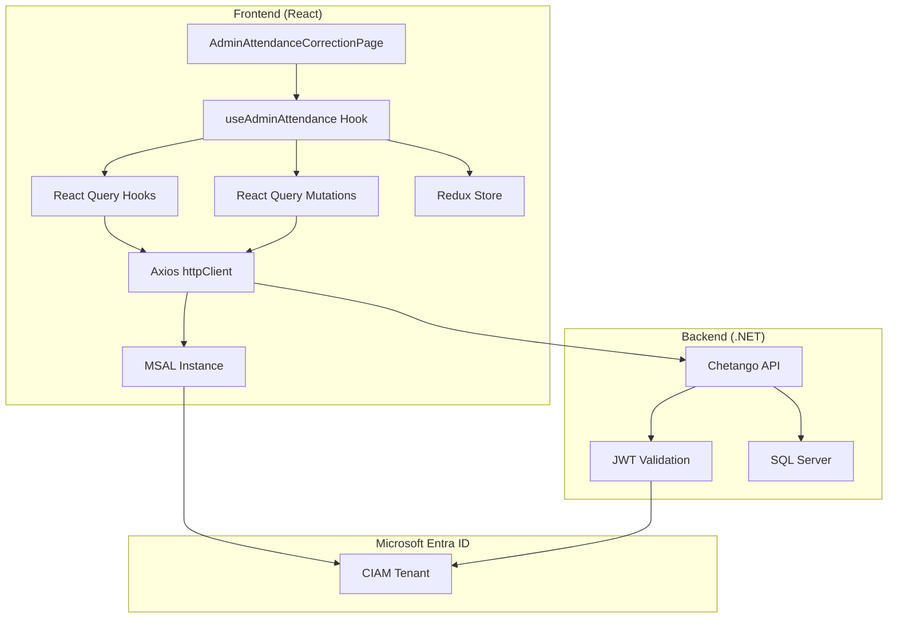
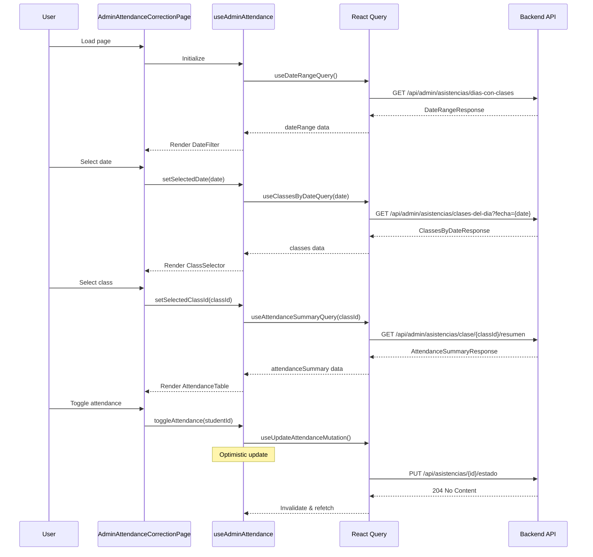

# Design Document: Admin Attendance Integration

## Overview

Este documento describe el diseño técnico para integrar la página de Corrección de Asistencias del frontend de Chetango con el API backend. La integración requiere actualizar la configuración de autenticación MSAL, corregir los endpoints de la API, y asegurar que el flujo de datos entre frontend y backend sea correcto.

El frontend está construido con React + TypeScript, usando:
- **MSAL.js** para autenticación con Microsoft Entra External ID
- **React Query** para manejo de estado del servidor
- **Redux Toolkit** para estado de UI
- **Axios** como cliente HTTP

## Architecture



## Components and Interfaces

### 1. MSAL Configuration

**Archivo:** `src/features/auth/api/msalConfig.ts`

```typescript
// Configuración actualizada según contrato del backend
export const msalConfig: Configuration = {
  auth: {
    clientId: 'd35c1d4d-9ddc-4a8b-bb89-1964b37ff573',
    authority: 'https://chetangoprueba.ciamlogin.com/8a57ec5a-e2e3-44ad-9494-77fbc7467251',
    redirectUri: window.location.origin + '/auth/callback',
  },
  cache: {
    cacheLocation: 'sessionStorage',
    storeAuthStateInCookie: false,
  },
}

export const tokenRequest = {
  scopes: [
    'openid',
    'profile', 
    'email',
    'api://d35c1d4d-9ddc-4a8b-bb89-1964b37ff573/chetango.api'
  ],
}
```

### 2. Environment Configuration

**Archivo:** `.env`

```properties
# Microsoft Entra External ID Configuration
VITE_ENTRA_TENANT_ID=8a57ec5a-e2e3-44ad-9494-77fbc7467251
VITE_ENTRA_CLIENT_ID=d35c1d4d-9ddc-4a8b-bb89-1964b37ff573
VITE_ENTRA_AUTHORITY=https://chetangoprueba.ciamlogin.com/8a57ec5a-e2e3-44ad-9494-77fbc7467251
VITE_ENTRA_REDIRECT_URI=http://localhost:5173/auth/callback
VITE_ENTRA_SCOPES=openid,profile,email,api://d35c1d4d-9ddc-4a8b-bb89-1964b37ff573/chetango.api

# API Configuration
VITE_API_BASE_URL=https://localhost:7194
```

### 3. HTTP Client Configuration

**Archivo:** `src/shared/api/httpClient.ts`

```typescript
import axios from 'axios'
import { ENV_CONFIG } from '@/shared/constants/env'

const httpClient = axios.create({
  baseURL: ENV_CONFIG.API_URL, // https://localhost:7194
  timeout: ENV_CONFIG.API_TIMEOUT,
  headers: {
    'Content-Type': 'application/json',
  },
})

export { httpClient }
```

### 4. API Types (Actualizados)

**Archivo:** `src/features/attendance/types/attendanceTypes.ts`

```typescript
// Response types (sin cambios - ya están correctos)
export interface DateRangeResponse {
  hoy: string
  desde: string
  hasta: string
  diasConClases: string[]
}

export interface ClassesByDateResponse {
  fecha: string
  clases: ClassInfo[]
}

export interface ClassInfo {
  idClase: string
  nombre: string
  horaInicio: string
  horaFin: string
  profesorPrincipal: string
}

export interface AttendanceSummaryResponse {
  idClase: string
  fecha: string
  nombreClase: string
  profesorPrincipal: string
  alumnos: StudentAttendance[]
  presentes: number
  ausentes: number
  sinPaquete: number
}

export interface StudentAttendance {
  idAlumno: string
  nombreCompleto: string
  documentoIdentidad: string
  avatarIniciales: string
  paquete: StudentPackage | null
  asistencia: AttendanceRecord // Renombrado para claridad
}

export interface AttendanceRecord {
  idAsistencia: string | null  // NUEVO: necesario para updates
  estado: 'Presente' | 'Ausente'
  observacion: string | null
}

// Request types (CORREGIDOS según contrato)
export interface UpdateAttendanceRequest {
  idAsistencia: string
  presente: boolean  // CAMBIADO: era 'estado', ahora es boolean
  observacion?: string
}

export interface RegisterAttendanceRequest {
  idClase: string
  idAlumno: string
  presente: boolean
  observacion?: string
}
```

### 5. API Mutations (Corregidas)

**Archivo:** `src/features/attendance/api/attendanceMutations.ts`

```typescript
import { useMutation, useQueryClient } from '@tanstack/react-query'
import { httpClient } from '@/shared/api/httpClient'
import { toast } from 'sonner'
import { attendanceKeys } from './attendanceQueries'
import type {
  UpdateAttendanceRequest,
  RegisterAttendanceRequest,
  AttendanceSummaryResponse,
  StudentAttendance,
} from '../types/attendanceTypes'

/**
 * Updates attendance status for an existing record
 * PUT /api/asistencias/{id}/estado
 */
export function useUpdateAttendanceMutation() {
  const queryClient = useQueryClient()

  return useMutation({
    mutationFn: async (data: UpdateAttendanceRequest) => {
      await httpClient.put(`/api/asistencias/${data.idAsistencia}/estado`, {
        idAsistencia: data.idAsistencia,
        presente: data.presente,
        observacion: data.observacion,
      })
    },
    // ... optimistic update logic
  })
}

/**
 * Registers a new attendance record
 * POST /api/asistencias
 */
export function useRegisterAttendanceMutation() {
  const queryClient = useQueryClient()

  return useMutation({
    mutationFn: async (data: RegisterAttendanceRequest): Promise<string> => {
      const response = await httpClient.post<string>('/api/asistencias', data)
      return response.data // Returns new attendance ID
    },
    // ... success/error handling
  })
}
```

### 6. Component Flow



## Data Models

### API Response Mapping

| Backend Field | Frontend Type | Notes |
|--------------|---------------|-------|
| `idAsistencia` | `string \| null` | Null si no hay registro previo |
| `presente` | `boolean` | Backend usa boolean, no enum |
| `estado` | `'Presente' \| 'Ausente'` | Frontend display value |
| `observacion` | `string \| null` | Optional field |

### State Management

```typescript
// Redux slice state
interface AttendanceUIState {
  selectedDate: string          // YYYY-MM-DD format
  selectedClassId: string | null
  searchTerm: string
  updatingStudents: Record<string, boolean>
}

// React Query cache keys
const attendanceKeys = {
  all: ['attendance'],
  dateRange: () => [...attendanceKeys.all, 'dateRange'],
  classesByDate: (fecha: string) => [...attendanceKeys.all, 'classes', fecha],
  summary: (idClase: string) => [...attendanceKeys.all, 'summary', idClase],
}
```

## Correctness Properties

*A property is a characteristic or behavior that should hold true across all valid executions of a system—essentially, a formal statement about what the system should do. Properties serve as the bridge between human-readable specifications and machine-verifiable correctness guarantees.*

### Property 1: Auth Interceptor Token Injection

*For any* HTTP request made through httpClient, the Authorization header SHALL contain a valid Bearer token in the format `Bearer {access_token}`.

**Validates: Requirements 2.2**

### Property 2: DateRange Response Parsing

*For any* valid response from `/api/admin/asistencias/dias-con-clases`, the parsed DateRangeResponse SHALL contain all four fields: `hoy`, `desde`, `hasta`, and `diasConClases` array.

**Validates: Requirements 3.2**

### Property 3: Date Filter Display

*For any* DateRangeResponse with `desde` and `hasta` dates, the DateFilter component SHALL render exactly the number of days between those dates (inclusive), and dates present in `diasConClases` SHALL have a visual highlight indicator.

**Validates: Requirements 3.3, 3.4**

### Property 4: ClassesByDate Query Trigger

*For any* date selection in the DateFilter, the ClassesByDate query SHALL be called with the selected date in YYYY-MM-DD format as the `fecha` query parameter.

**Validates: Requirements 4.1**

### Property 5: Class Display Format

*For any* ClassInfo object, the formatted display string SHALL follow the pattern `{nombre} - {horaInicio} a {horaFin} ({profesorPrincipal})`.

**Validates: Requirements 4.3**

### Property 6: AttendanceSummary Query Trigger

*For any* class selection in the ClassSelector, the AttendanceSummary query SHALL be called with the selected class ID as a path parameter.

**Validates: Requirements 5.1**

### Property 7: Attendance Table Student Display

*For any* StudentAttendance object in the response, the AttendanceTable SHALL display: nombreCompleto, documentoIdentidad, paquete.estado (or "Sin Paquete"), asistencia.estado, and asistencia.observacion.

**Validates: Requirements 5.3**

### Property 8: Stats Summary Accuracy

*For any* AttendanceSummaryResponse, the StatsSummary component SHALL display the exact values of `presentes`, `ausentes`, and `sinPaquete` from the response.

**Validates: Requirements 5.4**

### Property 9: Update Mutation Request Format

*For any* attendance update (toggle or observation change), the mutation SHALL call `PUT /api/asistencias/{idAsistencia}/estado` with a body containing `idAsistencia` (string), `presente` (boolean), and optionally `observacion` (string).

**Validates: Requirements 6.1, 6.2, 8.1**

### Property 10: Register Mutation Request Format

*For any* new attendance registration, the mutation SHALL call `POST /api/asistencias` with a body containing `idClase`, `idAlumno`, `presente` (boolean), and optionally `observacion`.

**Validates: Requirements 7.2**

### Property 11: Search Filter Behavior

*For any* search term entered in StudentSearch, the filtered results SHALL include only students whose `nombreCompleto` OR `documentoIdentidad` contains the search term (case-insensitive), and the filtering SHALL be debounced by 300ms.

**Validates: Requirements 9.1, 9.3**

### Property 12: Filtered Stats Accuracy

*For any* filtered student list, the StatsSummary SHALL display counts calculated from the filtered list, not the original list.

**Validates: Requirements 9.5**

### Property 13: Observation Debounce

*For any* sequence of observation input changes, the update mutation SHALL only be called once, 500ms after the last change.

**Validates: Requirements 8.2**

## Error Handling

### HTTP Error Codes

| Code | Handling | User Message |
|------|----------|--------------|
| 401 | Redirect to login | (automatic redirect) |
| 403 | Show inline error | "No tienes permisos para acceder a esta función" |
| 404 | Show toast | "El recurso solicitado no existe" |
| 400 | Show toast with API message | (message from response) |
| 500 | Show toast | "Error del servidor. Intenta de nuevo." |

### Error Interceptor

```typescript
// src/shared/api/interceptors/errorInterceptor.ts
export const setupErrorInterceptor = (httpClient: AxiosInstance) => {
  return httpClient.interceptors.response.use(
    (response) => response,
    (error) => {
      const status = error.response?.status
      const message = error.response?.data?.message
      
      switch (status) {
        case 403:
          toast.error('No tienes permisos para acceder a esta función')
          break
        case 404:
          toast.error('El recurso solicitado no existe')
          break
        case 400:
          toast.error(message || 'Datos inválidos')
          break
        case 500:
          toast.error('Error del servidor. Intenta de nuevo.')
          break
      }
      
      return Promise.reject(error)
    }
  )
}
```

### Optimistic Update Rollback

```typescript
// En useUpdateAttendanceMutation
onError: (error, variables, context) => {
  // Rollback al estado anterior
  if (context?.previousData) {
    queryClient.setQueryData(
      attendanceKeys.summary(variables.idClase),
      context.previousData
    )
  }
  toast.error('Error al actualizar asistencia')
}
```

## Testing Strategy

### Unit Tests

Los unit tests verificarán:
- Configuración correcta de MSAL (client ID, authority, scopes)
- Formato de requests a la API
- Parsing de responses
- Lógica de filtrado de búsqueda
- Cálculo de estadísticas

### Property-Based Tests

Se usará **fast-check** para property-based testing en TypeScript.

Cada property test debe:
- Ejecutar mínimo 100 iteraciones
- Referenciar el property del design document
- Usar el tag format: `Feature: admin-attendance-integration, Property N: {property_text}`

### Integration Tests

Los integration tests verificarán:
- Flujo completo de autenticación
- Llamadas a la API con tokens válidos
- Manejo de errores HTTP
- Optimistic updates y rollbacks

### Test Configuration

```typescript
// vitest.config.ts
export default defineConfig({
  test: {
    environment: 'jsdom',
    setupFiles: ['./src/test/setup.ts'],
    coverage: {
      provider: 'v8',
      reporter: ['text', 'json', 'html'],
    },
  },
})
```
