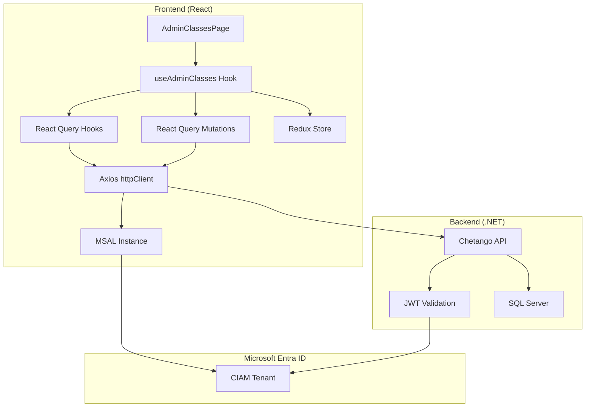
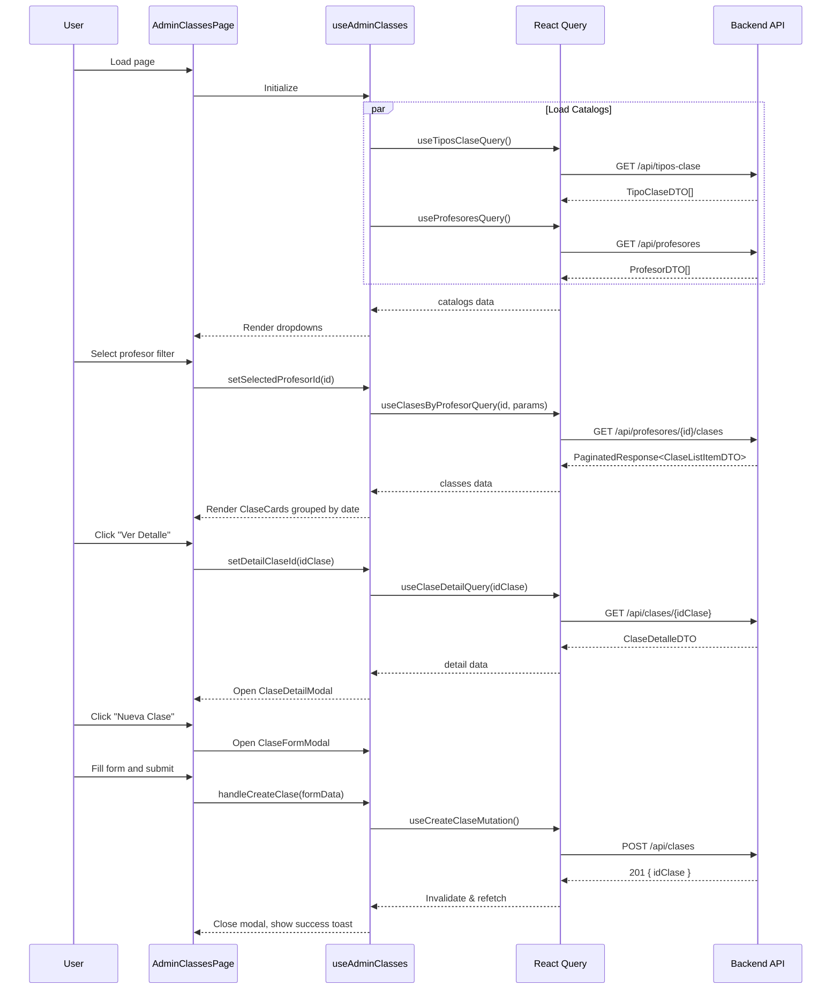

# Design Document: Admin Classes Integration

## Overview

Este documento describe el diseño técnico para integrar la página de Gestión de Clases del panel de administración del frontend de Chetango con el API backend. La integración reutiliza la configuración de autenticación MSAL existente y sigue los patrones establecidos en la integración de asistencias.

El frontend está construido con React + TypeScript, usando:
- **MSAL.js** para autenticación con Microsoft Entra External ID
- **React Query** para manejo de estado del servidor
- **Redux Toolkit** para estado de UI
- **Axios** como cliente HTTP

## Architecture



## Components and Interfaces

### 1. API Types

**Archivo:** `src/features/classes/types/classTypes.ts`

```typescript
// ============================================
// CATALOG TYPES (Lookups)
// ============================================

export interface TipoClaseDTO {
  id: string;           // Guid
  nombre: string;
}

export interface ProfesorDTO {
  idProfesor: string;   // Guid
  nombreCompleto: string;
  tipoProfesor: 'Titular' | 'Monitor';
}

export interface AlumnoDTO {
  idAlumno: string;     // Guid
  nombreCompleto: string;
  correo: string;
}

// ============================================
// CLASS TYPES
// ============================================

export type ClaseEstado = 'hoy' | 'programada' | 'completada' | 'cancelada';

export interface ClaseListItemDTO {
  idClase: string;              // Guid
  fecha: string;                // DateTime ISO 8601
  horaInicio: string;           // TimeSpan "HH:mm:ss"
  horaFin: string;              // TimeSpan "HH:mm:ss"
  tipoClase: string;            // Nombre del tipo
  cupoMaximo: number;
  totalAsistencias: number;
}

export interface ClaseDetalleDTO {
  idClase: string;              // Guid
  fecha: string;                // DateTime ISO 8601
  horaInicio: string;           // TimeSpan "HH:mm:ss"
  horaFin: string;              // TimeSpan "HH:mm:ss"
  tipoClase: string;            // Nombre del tipo
  idProfesorPrincipal: string;  // Guid
  nombreProfesor: string;
  cupoMaximo: number;
  observaciones: string | null;
  totalAsistencias: number;
  monitores: MonitorClaseDTO[];
}

export interface MonitorClaseDTO {
  idProfesor: string;           // Guid
  nombreProfesor: string;
}

// ============================================
// REQUEST TYPES
// ============================================

export interface CrearClaseRequest {
  idProfesorPrincipal: string;  // Guid
  idTipoClase: string;          // Guid
  fecha: string;                // DateTime ISO 8601 (solo fecha)
  horaInicio: string;           // TimeSpan "HH:mm:ss"
  horaFin: string;              // TimeSpan "HH:mm:ss"
  cupoMaximo: number;
  observaciones?: string;
}

export interface EditarClaseRequest {
  idTipoClase: string;          // Guid
  idProfesor: string;           // Guid
  fechaHoraInicio: string;      // DateTime ISO 8601 (fecha + hora)
  duracionMinutos: number;
  cupoMaximo: number;
  observaciones?: string;
}

// ============================================
// RESPONSE TYPES
// ============================================

export interface CrearClaseResponse {
  idClase: string;              // Guid
}

export interface PaginatedResponse<T> {
  items: T[];
  paginaActual: number;
  totalPaginas: number;
  tamanoPagina: number;
  totalRegistros: number;
  tienePaginaAnterior: boolean;
  tienePaginaSiguiente: boolean;
}

// ============================================
// QUERY PARAMS
// ============================================

export interface ClasesQueryParams {
  fechaDesde?: string;          // DateTime ISO 8601
  fechaHasta?: string;          // DateTime ISO 8601
  pagina?: number;
  tamanoPagina?: number;
}

// ============================================
// UI STATE TYPES
// ============================================

export interface ClaseFormData {
  fecha: string;
  horaInicio: string;
  horaFin: string;
  idTipoClase: string;
  idProfesorPrincipal: string;
  monitores: string[];          // Array of idProfesor
  cupoMaximo: number;
  observaciones: string;
}

export interface ClassesFilters {
  searchTerm: string;
  filterProfesor: string;       // 'todos' | idProfesor
  filterTipo: string;           // 'todos' | idTipoClase
  filterFecha: string;          // '' | YYYY-MM-DD
}
```

### 2. React Query Hooks

**Archivo:** `src/features/classes/api/classQueries.ts`

```typescript
import { useQuery } from '@tanstack/react-query';
import { httpClient } from '@/shared/api/httpClient';
import type {
  TipoClaseDTO,
  ProfesorDTO,
  ClaseDetalleDTO,
  ClaseListItemDTO,
  PaginatedResponse,
  ClasesQueryParams,
} from '../types/classTypes';

// Query Keys
export const classKeys = {
  all: ['classes'] as const,
  tiposClase: () => [...classKeys.all, 'tipos-clase'] as const,
  profesores: () => [...classKeys.all, 'profesores'] as const,
  clasesByProfesor: (idProfesor: string, params: ClasesQueryParams) => 
    [...classKeys.all, 'by-profesor', idProfesor, params] as const,
  claseDetail: (idClase: string) => [...classKeys.all, 'detail', idClase] as const,
};

/**
 * Fetches all class types for dropdowns
 * GET /api/tipos-clase
 */
export function useTiposClaseQuery() {
  return useQuery({
    queryKey: classKeys.tiposClase(),
    queryFn: async (): Promise<TipoClaseDTO[]> => {
      const response = await httpClient.get<TipoClaseDTO[]>('/api/tipos-clase');
      return response.data;
    },
    staleTime: 5 * 60 * 1000, // 5 minutes - catalogs don't change often
  });
}

/**
 * Fetches all active professors for dropdowns (Admin only)
 * GET /api/profesores
 */
export function useProfesoresQuery() {
  return useQuery({
    queryKey: classKeys.profesores(),
    queryFn: async (): Promise<ProfesorDTO[]> => {
      const response = await httpClient.get<ProfesorDTO[]>('/api/profesores');
      return response.data;
    },
    staleTime: 5 * 60 * 1000, // 5 minutes
  });
}

/**
 * Fetches classes for a specific professor with pagination
 * GET /api/profesores/{idProfesor}/clases
 */
export function useClasesByProfesorQuery(
  idProfesor: string,
  params: ClasesQueryParams,
  enabled: boolean = true
) {
  return useQuery({
    queryKey: classKeys.clasesByProfesor(idProfesor, params),
    queryFn: async (): Promise<PaginatedResponse<ClaseListItemDTO>> => {
      const queryParams = new URLSearchParams();
      if (params.fechaDesde) queryParams.append('fechaDesde', params.fechaDesde);
      if (params.fechaHasta) queryParams.append('fechaHasta', params.fechaHasta);
      if (params.pagina) queryParams.append('pagina', params.pagina.toString());
      if (params.tamanoPagina) queryParams.append('tamanoPagina', params.tamanoPagina.toString());
      
      const url = `/api/profesores/${idProfesor}/clases?${queryParams.toString()}`;
      const response = await httpClient.get<PaginatedResponse<ClaseListItemDTO>>(url);
      return response.data;
    },
    enabled: enabled && !!idProfesor,
  });
}

/**
 * Fetches detailed information for a specific class
 * GET /api/clases/{id}
 */
export function useClaseDetailQuery(idClase: string, enabled: boolean = true) {
  return useQuery({
    queryKey: classKeys.claseDetail(idClase),
    queryFn: async (): Promise<ClaseDetalleDTO> => {
      const response = await httpClient.get<ClaseDetalleDTO>(`/api/clases/${idClase}`);
      return response.data;
    },
    enabled: enabled && !!idClase,
  });
}
```

### 3. React Query Mutations

**Archivo:** `src/features/classes/api/classMutations.ts`

```typescript
import { useMutation, useQueryClient } from '@tanstack/react-query';
import { httpClient } from '@/shared/api/httpClient';
import { toast } from 'sonner';
import { classKeys } from './classQueries';
import type {
  CrearClaseRequest,
  CrearClaseResponse,
  EditarClaseRequest,
} from '../types/classTypes';

/**
 * Creates a new class
 * POST /api/clases
 */
export function useCreateClaseMutation() {
  const queryClient = useQueryClient();

  return useMutation({
    mutationFn: async (data: CrearClaseRequest): Promise<CrearClaseResponse> => {
      const response = await httpClient.post<CrearClaseResponse>('/api/clases', data);
      return response.data;
    },
    onSuccess: (data) => {
      toast.success('Clase creada exitosamente');
      // Invalidate all class lists to refetch
      queryClient.invalidateQueries({ queryKey: classKeys.all });
    },
    onError: (error: any) => {
      const message = error.response?.data?.error || 'Error al crear la clase';
      toast.error(message);
    },
  });
}

/**
 * Updates an existing class
 * PUT /api/clases/{id}
 */
export function useUpdateClaseMutation() {
  const queryClient = useQueryClient();

  return useMutation({
    mutationFn: async ({ idClase, data }: { idClase: string; data: EditarClaseRequest }) => {
      await httpClient.put(`/api/clases/${idClase}`, data);
    },
    onSuccess: (_, variables) => {
      toast.success('Clase actualizada exitosamente');
      // Invalidate specific class and all lists
      queryClient.invalidateQueries({ queryKey: classKeys.claseDetail(variables.idClase) });
      queryClient.invalidateQueries({ queryKey: classKeys.all });
    },
    onError: (error: any) => {
      const message = error.response?.data?.error || 'Error al actualizar la clase';
      toast.error(message);
    },
  });
}

/**
 * Cancels/deletes a class
 * DELETE /api/clases/{id}
 */
export function useDeleteClaseMutation() {
  const queryClient = useQueryClient();

  return useMutation({
    mutationFn: async (idClase: string) => {
      await httpClient.delete(`/api/clases/${idClase}`);
    },
    onSuccess: (_, idClase) => {
      toast.success('Clase cancelada exitosamente');
      // Invalidate all class queries
      queryClient.invalidateQueries({ queryKey: classKeys.all });
    },
    onError: (error: any) => {
      const message = error.response?.data?.error || 'Error al cancelar la clase';
      toast.error(message);
    },
  });
}
```

### 4. Custom Hook: useAdminClasses

**Archivo:** `src/features/classes/hooks/useAdminClasses.ts`

```typescript
import { useState, useMemo, useCallback } from 'react';
import { useAppDispatch, useAppSelector } from '@/app/store/hooks';
import {
  useTiposClaseQuery,
  useProfesoresQuery,
  useClasesByProfesorQuery,
  useClaseDetailQuery,
} from '../api/classQueries';
import {
  useCreateClaseMutation,
  useUpdateClaseMutation,
  useDeleteClaseMutation,
} from '../api/classMutations';
import {
  setSearchTerm,
  setFilterProfesor,
  setFilterTipo,
  setFilterFecha,
  setSelectedClaseId,
  clearFilters,
} from '../store/classesSlice';
import type {
  ClaseFormData,
  CrearClaseRequest,
  EditarClaseRequest,
  ClaseListItemDTO,
  ClaseEstado,
} from '../types/classTypes';

export function useAdminClasses() {
  const dispatch = useAppDispatch();
  const filters = useAppSelector((state) => state.classes);
  
  // Catalogs
  const tiposClaseQuery = useTiposClaseQuery();
  const profesoresQuery = useProfesoresQuery();
  
  // Selected profesor for fetching classes (default to first or 'todos')
  const [selectedProfesorId, setSelectedProfesorId] = useState<string>('');
  
  // Classes query with pagination
  const [queryParams, setQueryParams] = useState({
    fechaDesde: '',
    fechaHasta: '',
    pagina: 1,
    tamanoPagina: 50,
  });
  
  const clasesQuery = useClasesByProfesorQuery(
    selectedProfesorId,
    queryParams,
    !!selectedProfesorId
  );
  
  // Detail query for modal
  const [detailClaseId, setDetailClaseId] = useState<string | null>(null);
  const claseDetailQuery = useClaseDetailQuery(detailClaseId || '', !!detailClaseId);
  
  // Mutations
  const createMutation = useCreateClaseMutation();
  const updateMutation = useUpdateClaseMutation();
  const deleteMutation = useDeleteClaseMutation();
  
  // Determine class estado based on date
  const getClaseEstado = useCallback((clase: ClaseListItemDTO): ClaseEstado => {
    const hoy = new Date().toISOString().split('T')[0];
    const claseDate = clase.fecha.split('T')[0];
    
    if (claseDate === hoy) return 'hoy';
    if (claseDate < hoy) return 'completada';
    return 'programada';
  }, []);
  
  // Filter classes client-side
  const filteredClases = useMemo(() => {
    if (!clasesQuery.data?.items) return [];
    
    return clasesQuery.data.items.filter((clase) => {
      const matchSearch = 
        filters.searchTerm === '' ||
        clase.tipoClase.toLowerCase().includes(filters.searchTerm.toLowerCase());
      
      const matchTipo = 
        filters.filterTipo === 'todos' ||
        clase.tipoClase === filters.filterTipo;
      
      const matchFecha = 
        filters.filterFecha === '' ||
        clase.fecha.startsWith(filters.filterFecha);
      
      return matchSearch && matchTipo && matchFecha;
    });
  }, [clasesQuery.data?.items, filters]);
  
  // Group classes by date
  const clasesByDate = useMemo(() => {
    const grouped: Record<string, ClaseListItemDTO[]> = {};
    
    filteredClases.forEach((clase) => {
      const date = clase.fecha.split('T')[0];
      if (!grouped[date]) {
        grouped[date] = [];
      }
      grouped[date].push(clase);
    });
    
    // Sort by time within each date
    Object.keys(grouped).forEach((date) => {
      grouped[date].sort((a, b) => a.horaInicio.localeCompare(b.horaInicio));
    });
    
    return grouped;
  }, [filteredClases]);
  
  // Sorted dates
  const sortedDates = useMemo(() => {
    return Object.keys(clasesByDate).sort((a, b) => 
      new Date(a).getTime() - new Date(b).getTime()
    );
  }, [clasesByDate]);
  
  // Stats
  const stats = useMemo(() => {
    const hoy = new Date().toISOString().split('T')[0];
    const items = clasesQuery.data?.items || [];
    
    const clasesHoy = items.filter((c) => c.fecha.startsWith(hoy)).length;
    
    const ahora = new Date();
    const enUnaSemana = new Date(ahora.getTime() + 7 * 24 * 60 * 60 * 1000);
    const clasesSemana = items.filter((c) => {
      const fecha = new Date(c.fecha);
      return fecha >= ahora && fecha <= enUnaSemana;
    }).length;
    
    // Note: canceladas would need to come from backend or be tracked separately
    const clasesCanceladas = 0; // Placeholder
    
    return { clasesHoy, clasesSemana, clasesCanceladas };
  }, [clasesQuery.data?.items]);
  
  // Actions
  const handleCreateClase = useCallback(async (formData: ClaseFormData) => {
    const request: CrearClaseRequest = {
      idProfesorPrincipal: formData.idProfesorPrincipal,
      idTipoClase: formData.idTipoClase,
      fecha: formData.fecha + 'T00:00:00',
      horaInicio: formData.horaInicio + ':00',
      horaFin: formData.horaFin + ':00',
      cupoMaximo: formData.cupoMaximo,
      observaciones: formData.observaciones || undefined,
    };
    
    return createMutation.mutateAsync(request);
  }, [createMutation]);
  
  const handleUpdateClase = useCallback(async (idClase: string, formData: ClaseFormData) => {
    // Calculate duration in minutes
    const [startHour, startMin] = formData.horaInicio.split(':').map(Number);
    const [endHour, endMin] = formData.horaFin.split(':').map(Number);
    const duracionMinutos = (endHour * 60 + endMin) - (startHour * 60 + startMin);
    
    const request: EditarClaseRequest = {
      idTipoClase: formData.idTipoClase,
      idProfesor: formData.idProfesorPrincipal,
      fechaHoraInicio: `${formData.fecha}T${formData.horaInicio}:00`,
      duracionMinutos,
      cupoMaximo: formData.cupoMaximo,
      observaciones: formData.observaciones || undefined,
    };
    
    return updateMutation.mutateAsync({ idClase, data: request });
  }, [updateMutation]);
  
  const handleDeleteClase = useCallback(async (idClase: string) => {
    return deleteMutation.mutateAsync(idClase);
  }, [deleteMutation]);
  
  return {
    // Catalogs
    tiposClase: tiposClaseQuery.data || [],
    profesores: profesoresQuery.data || [],
    isCatalogsLoading: tiposClaseQuery.isLoading || profesoresQuery.isLoading,
    
    // Classes
    clases: filteredClases,
    clasesByDate,
    sortedDates,
    isClasesLoading: clasesQuery.isLoading,
    clasesError: clasesQuery.error,
    pagination: clasesQuery.data ? {
      paginaActual: clasesQuery.data.paginaActual,
      totalPaginas: clasesQuery.data.totalPaginas,
      totalRegistros: clasesQuery.data.totalRegistros,
      tienePaginaAnterior: clasesQuery.data.tienePaginaAnterior,
      tienePaginaSiguiente: clasesQuery.data.tienePaginaSiguiente,
    } : null,
    
    // Detail
    claseDetail: claseDetailQuery.data,
    isDetailLoading: claseDetailQuery.isLoading,
    setDetailClaseId,
    
    // Filters
    filters,
    setSearchTerm: (term: string) => dispatch(setSearchTerm(term)),
    setFilterProfesor: (id: string) => {
      dispatch(setFilterProfesor(id));
      setSelectedProfesorId(id === 'todos' ? '' : id);
    },
    setFilterTipo: (tipo: string) => dispatch(setFilterTipo(tipo)),
    setFilterFecha: (fecha: string) => dispatch(setFilterFecha(fecha)),
    clearFilters: () => dispatch(clearFilters()),
    
    // Query params
    setQueryParams,
    selectedProfesorId,
    setSelectedProfesorId,
    
    // Stats
    stats,
    getClaseEstado,
    
    // Mutations
    handleCreateClase,
    handleUpdateClase,
    handleDeleteClase,
    isCreating: createMutation.isPending,
    isUpdating: updateMutation.isPending,
    isDeleting: deleteMutation.isPending,
    
    // Refetch
    refetchClases: clasesQuery.refetch,
  };
}
```


### 5. Redux Slice for UI State

**Archivo:** `src/features/classes/store/classesSlice.ts`

```typescript
import { createSlice, PayloadAction } from '@reduxjs/toolkit';

interface ClassesUIState {
  searchTerm: string;
  filterProfesor: string;       // 'todos' | idProfesor
  filterTipo: string;           // 'todos' | nombre tipo
  filterFecha: string;          // '' | YYYY-MM-DD
  selectedClaseId: string | null;
}

const initialState: ClassesUIState = {
  searchTerm: '',
  filterProfesor: 'todos',
  filterTipo: 'todos',
  filterFecha: '',
  selectedClaseId: null,
};

const classesSlice = createSlice({
  name: 'classes',
  initialState,
  reducers: {
    setSearchTerm: (state, action: PayloadAction<string>) => {
      state.searchTerm = action.payload;
    },
    setFilterProfesor: (state, action: PayloadAction<string>) => {
      state.filterProfesor = action.payload;
    },
    setFilterTipo: (state, action: PayloadAction<string>) => {
      state.filterTipo = action.payload;
    },
    setFilterFecha: (state, action: PayloadAction<string>) => {
      state.filterFecha = action.payload;
    },
    setSelectedClaseId: (state, action: PayloadAction<string | null>) => {
      state.selectedClaseId = action.payload;
    },
    clearFilters: (state) => {
      state.searchTerm = '';
      state.filterProfesor = 'todos';
      state.filterTipo = 'todos';
      state.filterFecha = '';
    },
  },
});

export const {
  setSearchTerm,
  setFilterProfesor,
  setFilterTipo,
  setFilterFecha,
  setSelectedClaseId,
  clearFilters,
} = classesSlice.actions;

export default classesSlice.reducer;
```

### 6. Component Flow



## Data Models

### API Response Mapping

| Backend Field | Frontend Type | Notes |
|--------------|---------------|-------|
| `idClase` | `string` | Guid as string |
| `fecha` | `string` | DateTime ISO 8601, extract date part |
| `horaInicio` | `string` | TimeSpan "HH:mm:ss" |
| `horaFin` | `string` | TimeSpan "HH:mm:ss" |
| `tipoClase` | `string` | Nombre del tipo (not ID) |
| `cupoMaximo` | `number` | int |
| `totalAsistencias` | `number` | int - inscriptos count |
| `observaciones` | `string \| null` | Optional field |

### Estado Calculation

```typescript
function getClaseEstado(fecha: string): ClaseEstado {
  const hoy = new Date().toISOString().split('T')[0];
  const claseDate = fecha.split('T')[0];
  
  if (claseDate === hoy) return 'hoy';
  if (claseDate < hoy) return 'completada';
  return 'programada';
}
// Note: 'cancelada' estado comes from backend or separate tracking
```

### Duration Calculation

```typescript
function calculateDuration(horaInicio: string, horaFin: string): string {
  const [startH, startM] = horaInicio.split(':').map(Number);
  const [endH, endM] = horaFin.split(':').map(Number);
  
  const totalMinutes = (endH * 60 + endM) - (startH * 60 + startMin);
  const hours = Math.floor(totalMinutes / 60);
  const minutes = totalMinutes % 60;
  
  if (hours > 0 && minutes > 0) return `${hours}h ${minutes}min`;
  if (hours > 0) return `${hours}h`;
  return `${minutes}min`;
}
```

## Correctness Properties

*A property is a characteristic or behavior that should hold true across all valid executions of a system—essentially, a formal statement about what the system should do. Properties serve as the bridge between human-readable specifications and machine-verifiable correctness guarantees.*

### Property 1: Catalogs Load on Page Init

*For any* page load of AdminClassesPage, the TiposClase and Profesores queries SHALL be triggered, and the dropdowns SHALL display data once loaded.

**Validates: Requirements 2.1, 2.3**

### Property 2: TiposClase Response Parsing

*For any* valid response from `/api/tipos-clase`, the parsed array SHALL contain objects with `id` (string) and `nombre` (string) fields.

**Validates: Requirements 2.2**

### Property 3: Profesores Response Parsing

*For any* valid response from `/api/profesores`, the parsed array SHALL contain objects with `idProfesor`, `nombreCompleto`, and `tipoProfesor` fields.

**Validates: Requirements 2.4**

### Property 4: Classes Query with Profesor Filter

*For any* profesor selection in the filter, the ClasesByProfesor query SHALL be called with that profesor's ID as a path parameter.

**Validates: Requirements 3.1, 3.9**

### Property 5: Classes Grouped by Date

*For any* list of classes returned from the API, the UI SHALL group them by date and sort each group by horaInicio ascending.

**Validates: Requirements 3.3**

### Property 6: ClaseCard Display Format

*For any* ClaseListItemDTO, the ClaseCard SHALL display: tipoClase, horario (horaInicio - horaFin), and capacity (totalAsistencias / cupoMaximo).

**Validates: Requirements 3.4**

### Property 7: Estado Badge Mapping

*For any* clase, the estado badge SHALL be: "Hoy" (red) if fecha equals today, "Programada" (purple) if fecha is future, "Completada" (green) if fecha is past.

**Validates: Requirements 3.5**

### Property 8: ClaseDetail Query Trigger

*For any* "Ver Detalle" click on a ClaseCard, the ClaseDetail query SHALL be called with the class ID as a path parameter.

**Validates: Requirements 4.1**

### Property 9: ClaseDetailModal Display

*For any* ClaseDetalleDTO, the modal SHALL display: estado badge, formatted fecha, horario with calculated duration, nombreProfesor, totalAsistencias/cupoMaximo with progress bar.

**Validates: Requirements 4.3**

### Property 10: Create Clase Request Format

*For any* class creation, the mutation SHALL call `POST /api/clases` with body containing: idProfesorPrincipal, idTipoClase, fecha (ISO 8601), horaInicio (HH:mm:ss), horaFin (HH:mm:ss), cupoMaximo, and optional observaciones.

**Validates: Requirements 5.3**

### Property 11: Create Clase Future Validation

*For any* class creation attempt, the form SHALL validate that fecha + horaInicio is in the future before submitting.

**Validates: Requirements 5.4**

### Property 12: Update Clase Request Format

*For any* class update, the mutation SHALL call `PUT /api/clases/{idClase}` with body containing: idTipoClase, idProfesor, fechaHoraInicio (ISO 8601), duracionMinutos (calculated), cupoMaximo, and optional observaciones.

**Validates: Requirements 6.3**

### Property 13: Delete Clase Confirmation

*For any* cancel button click, the system SHALL show a confirmation dialog before calling `DELETE /api/clases/{idClase}`.

**Validates: Requirements 7.1, 7.2**

### Property 14: Search Filter Behavior

*For any* search term entered, the filtered results SHALL include only classes whose tipoClase contains the search term (case-insensitive), and filtering SHALL be debounced by 300ms.

**Validates: Requirements 8.1, 8.7**

### Property 15: Stats Calculation Accuracy

*For any* loaded classes list, the stats SHALL correctly calculate: clasesHoy (classes with today's date), clasesSemana (classes within next 7 days).

**Validates: Requirements 9.1, 9.2**

### Property 16: Navigation to Attendance

*For any* "Ir a Asistencia" click, the system SHALL navigate to `/admin/asistencias?claseId={idClase}`.

**Validates: Requirements 12.2**

## Error Handling

### HTTP Error Codes

| Code | Handling | User Message |
|------|----------|--------------|
| 401 | Redirect to login | (automatic redirect) |
| 403 | Show inline error | "No tienes permisos para acceder a esta función" |
| 404 | Show toast | "La clase especificada no existe" |
| 400 | Show toast with API message | (message from response.data.error) |
| 500 | Show toast | "Error del servidor. Intenta de nuevo." |

### Error Handling in Mutations

```typescript
// In mutation onError callback
onError: (error: any) => {
  const status = error.response?.status;
  const message = error.response?.data?.error;
  
  switch (status) {
    case 400:
      // Business validation errors from backend
      toast.error(message || 'Datos inválidos');
      break;
    case 403:
      toast.error('No tienes permisos para realizar esta acción');
      break;
    case 404:
      toast.error('La clase especificada no existe');
      break;
    default:
      toast.error('Error del servidor. Intenta de nuevo.');
  }
}
```

### Common Backend Error Messages

| Error Message | Cause |
|--------------|-------|
| "El profesor ya tiene una clase programada en ese horario" | Schedule conflict |
| "La clase debe programarse para una fecha y hora futura" | Past date/time |
| "No puedes cancelar una clase que ya tiene asistencias registradas" | Has attendance records |
| "No tienes permiso para editar esta clase" | Ownership violation (for non-admin) |

## Testing Strategy

### Unit Tests

Los unit tests verificarán:
- Parsing correcto de responses de catálogos
- Formato de requests para crear/editar/cancelar clases
- Cálculo de estado de clase (hoy/programada/completada)
- Cálculo de duración de clase
- Lógica de filtrado client-side
- Cálculo de estadísticas

### Property-Based Tests

Se usará **fast-check** para property-based testing en TypeScript.

Cada property test debe:
- Ejecutar mínimo 100 iteraciones
- Referenciar el property del design document
- Usar el tag format: `Feature: admin-classes-integration, Property N: {property_text}`

### Integration Tests

Los integration tests verificarán:
- Flujo completo de crear clase
- Flujo completo de editar clase
- Flujo completo de cancelar clase
- Carga de catálogos y clases
- Navegación a asistencias

### Test Configuration

```typescript
// vitest.config.ts - same as attendance integration
export default defineConfig({
  test: {
    environment: 'jsdom',
    setupFiles: ['./src/test/setup.ts'],
    coverage: {
      provider: 'v8',
      reporter: ['text', 'json', 'html'],
    },
  },
})
```
