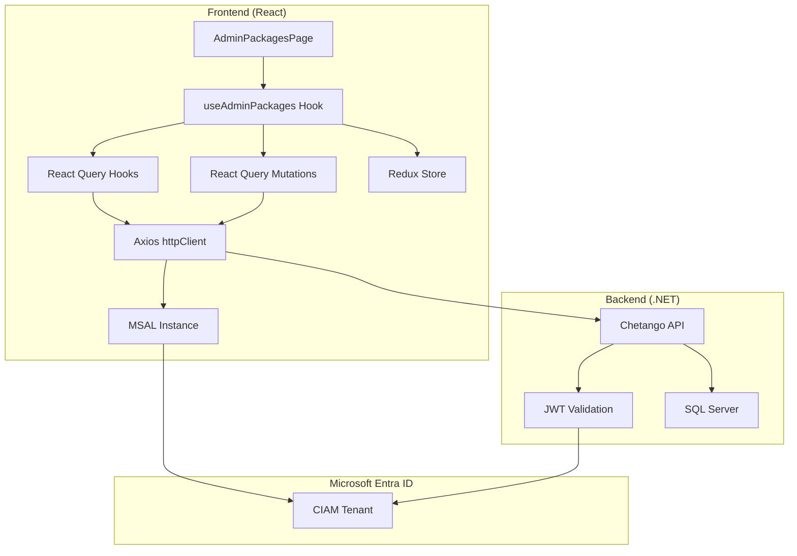
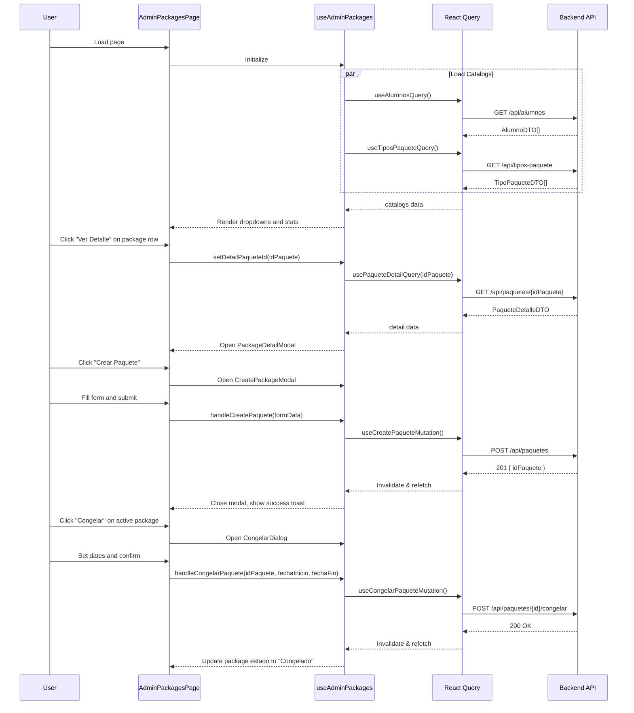

# Design Document: Admin Packages Integration

## Overview

Este documento describe el diseño técnico para integrar la página de Gestión de Paquetes del panel de administración del frontend de Chetango con el API backend. La integración reutiliza la configuración de autenticación MSAL existente y sigue los patrones establecidos en las integraciones de asistencias y clases.

El frontend está construido con React + TypeScript, usando:
- **MSAL.js** para autenticación con Microsoft Entra External ID
- **React Query** para manejo de estado del servidor
- **Redux Toolkit** para estado de UI
- **Axios** como cliente HTTP

## Architecture




## Components and Interfaces

### 1. API Types

**Archivo:** `src/features/packages/types/packageTypes.ts`

```typescript
// ============================================
// CATALOG TYPES (Lookups)
// ============================================

export interface AlumnoDTO {
  idAlumno: string;           // Guid
  nombreCompleto: string;
  documentoIdentidad: string;
  correo?: string;
}

export interface TipoPaqueteDTO {
  id: string;                 // Guid
  nombre: string;
  clasesDisponibles: number;
  diasVigencia: number;
  precio: number;
}

// ============================================
// PACKAGE TYPES
// ============================================

export type EstadoPaquete = 'Activo' | 'Vencido' | 'Congelado' | 'Agotado';
export type EstadoPaqueteId = 1 | 2 | 3 | 4;

export const ESTADO_PAQUETE_MAP: Record<EstadoPaqueteId, EstadoPaquete> = {
  1: 'Activo',
  2: 'Vencido',
  3: 'Congelado',
  4: 'Agotado',
};

export const ESTADO_PAQUETE_COLORS: Record<EstadoPaquete, string> = {
  Activo: 'green',
  Vencido: 'gray',
  Congelado: 'blue',
  Agotado: 'orange',
};

export interface PaqueteListItemDTO {
  idPaquete: string;              // Guid
  idAlumno: string;               // Guid
  nombreAlumno: string;
  documentoAlumno: string;
  nombreTipoPaquete: string;
  clasesDisponibles: number;
  clasesUsadas: number;
  clasesRestantes: number;
  fechaActivacion: string;        // DateTime ISO 8601
  fechaVencimiento: string;       // DateTime ISO 8601
  valorPaquete: number;
  idEstado: EstadoPaqueteId;
  estado: EstadoPaquete;
  estaVencido: boolean;
  tieneClasesDisponibles: boolean;
}

export interface CongelacionDTO {
  idCongelacion: string;          // Guid
  fechaInicio: string;            // DateTime ISO 8601
  fechaFin: string;               // DateTime ISO 8601
  diasCongelados: number;
}

export interface PaqueteDetalleDTO {
  idPaquete: string;              // Guid
  idAlumno: string;               // Guid
  nombreAlumno: string;
  idTipoPaquete: string;          // Guid
  nombreTipoPaquete: string;
  clasesDisponibles: number;
  clasesUsadas: number;
  clasesRestantes: number;
  fechaActivacion: string;        // DateTime ISO 8601
  fechaVencimiento: string;       // DateTime ISO 8601
  valorPaquete: number;
  idEstado: EstadoPaqueteId;
  estado: EstadoPaquete;
  estaVencido: boolean;
  tieneClasesDisponibles: boolean;
  congelaciones: CongelacionDTO[];
  historialConsumo?: AsistenciaHistorialDTO[];
}

export interface AsistenciaHistorialDTO {
  idAsistencia: string;           // Guid
  tipoClase: string;
  fecha: string;                  // DateTime ISO 8601
  horaInicio: string;             // TimeSpan "HH:mm:ss"
  horaFin: string;                // TimeSpan "HH:mm:ss"
  descontada: boolean;
}

// ============================================
// REQUEST TYPES
// ============================================

export interface CrearPaqueteRequest {
  idAlumno: string;               // Guid
  idTipoPaquete: string;          // Guid
  clasesDisponibles: number;
  valorPaquete: number;
  diasVigencia: number;
  idPago?: string | null;         // Guid - optional
}

export interface EditarPaqueteRequest {
  idPaquete: string;              // Guid
  clasesDisponibles: number;
  fechaVencimiento: string;       // DateTime ISO 8601
}

export interface CongelarPaqueteRequest {
  idPaquete: string;              // Guid
  fechaInicio: string;            // DateTime ISO 8601
  fechaFin: string;               // DateTime ISO 8601
  motivo?: string;
}

// ============================================
// RESPONSE TYPES
// ============================================

export interface CrearPaqueteResponse {
  idPaquete: string;              // Guid
}

export interface PaginatedResponse<T> {
  items: T[];
  pageNumber: number;
  totalPages: number;
  totalCount: number;
  hasPreviousPage: boolean;
  hasNextPage: boolean;
}

// ============================================
// QUERY PARAMS
// ============================================

export interface PaquetesQueryParams {
  soloActivos?: boolean;
  estado?: EstadoPaqueteId;
  fechaVencimientoDesde?: string;
  fechaVencimientoHasta?: string;
  pageNumber?: number;
  pageSize?: number;
}

// ============================================
// UI STATE TYPES
// ============================================

export interface PaqueteFormData {
  idAlumno: string;
  idTipoPaquete: string;
  fechaInicio: string;
  fechaFin: string;
  notasInternas: string;
}

export interface PackagesFilters {
  searchTerm: string;
  filterEstado: string;           // 'todos' | EstadoPaquete
  filterTipoPaquete: string;      // 'todos' | idTipoPaquete
}

export interface PackagesStats {
  total: number;
  activos: number;
  agotados: number;
  congelados: number;
  vencidos: number;
}
```

### 2. React Query Hooks

**Archivo:** `src/features/packages/api/packageQueries.ts`

```typescript
import { useQuery } from '@tanstack/react-query';
import { httpClient } from '@/shared/api/httpClient';
import type {
  AlumnoDTO,
  TipoPaqueteDTO,
  PaqueteDetalleDTO,
  PaqueteListItemDTO,
  PaginatedResponse,
  PaquetesQueryParams,
} from '../types/packageTypes';

// Query Keys
export const packageKeys = {
  all: ['packages'] as const,
  alumnos: () => [...packageKeys.all, 'alumnos'] as const,
  tiposPaquete: () => [...packageKeys.all, 'tipos-paquete'] as const,
  paquetesByAlumno: (idAlumno: string, params: PaquetesQueryParams) => 
    [...packageKeys.all, 'by-alumno', idAlumno, params] as const,
  allPaquetes: (params: PaquetesQueryParams) =>
    [...packageKeys.all, 'list', params] as const,
  paqueteDetail: (idPaquete: string) => 
    [...packageKeys.all, 'detail', idPaquete] as const,
};

/**
 * Fetches all active students for dropdowns
 * GET /api/alumnos
 */
export function useAlumnosQuery() {
  return useQuery({
    queryKey: packageKeys.alumnos(),
    queryFn: async (): Promise<AlumnoDTO[]> => {
      const response = await httpClient.get<AlumnoDTO[]>('/api/alumnos');
      return response.data;
    },
    staleTime: 5 * 60 * 1000, // 5 minutes
  });
}

/**
 * Fetches all package types for dropdowns
 * GET /api/tipos-paquete
 */
export function useTiposPaqueteQuery() {
  return useQuery({
    queryKey: packageKeys.tiposPaquete(),
    queryFn: async (): Promise<TipoPaqueteDTO[]> => {
      const response = await httpClient.get<TipoPaqueteDTO[]>('/api/tipos-paquete');
      return response.data;
    },
    staleTime: 5 * 60 * 1000, // 5 minutes
  });
}

/**
 * Fetches packages for a specific student with pagination
 * GET /api/alumnos/{idAlumno}/paquetes
 */
export function usePaquetesByAlumnoQuery(
  idAlumno: string,
  params: PaquetesQueryParams,
  enabled: boolean = true
) {
  return useQuery({
    queryKey: packageKeys.paquetesByAlumno(idAlumno, params),
    queryFn: async (): Promise<PaginatedResponse<PaqueteListItemDTO>> => {
      const queryParams = new URLSearchParams();
      if (params.soloActivos !== undefined) 
        queryParams.append('soloActivos', params.soloActivos.toString());
      if (params.estado) 
        queryParams.append('estado', params.estado.toString());
      if (params.fechaVencimientoDesde) 
        queryParams.append('fechaVencimientoDesde', params.fechaVencimientoDesde);
      if (params.fechaVencimientoHasta) 
        queryParams.append('fechaVencimientoHasta', params.fechaVencimientoHasta);
      if (params.pageNumber) 
        queryParams.append('pageNumber', params.pageNumber.toString());
      if (params.pageSize) 
        queryParams.append('pageSize', params.pageSize.toString());
      
      const url = `/api/alumnos/${idAlumno}/paquetes?${queryParams.toString()}`;
      const response = await httpClient.get<PaginatedResponse<PaqueteListItemDTO>>(url);
      return response.data;
    },
    enabled: enabled && !!idAlumno,
  });
}

/**
 * Fetches detailed information for a specific package
 * GET /api/paquetes/{id}
 */
export function usePaqueteDetailQuery(idPaquete: string, enabled: boolean = true) {
  return useQuery({
    queryKey: packageKeys.paqueteDetail(idPaquete),
    queryFn: async (): Promise<PaqueteDetalleDTO> => {
      const response = await httpClient.get<PaqueteDetalleDTO>(`/api/paquetes/${idPaquete}`);
      return response.data;
    },
    enabled: enabled && !!idPaquete,
  });
}
```

### 3. React Query Mutations

**Archivo:** `src/features/packages/api/packageMutations.ts`

```typescript
import { useMutation, useQueryClient } from '@tanstack/react-query';
import { httpClient } from '@/shared/api/httpClient';
import { toast } from 'sonner';
import { packageKeys } from './packageQueries';
import type {
  CrearPaqueteRequest,
  CrearPaqueteResponse,
  EditarPaqueteRequest,
  CongelarPaqueteRequest,
} from '../types/packageTypes';

/**
 * Creates a new package
 * POST /api/paquetes
 */
export function useCreatePaqueteMutation() {
  const queryClient = useQueryClient();

  return useMutation({
    mutationFn: async (data: CrearPaqueteRequest): Promise<CrearPaqueteResponse> => {
      const response = await httpClient.post<CrearPaqueteResponse>('/api/paquetes', data);
      return response.data;
    },
    onSuccess: () => {
      toast.success('Paquete creado exitosamente');
      queryClient.invalidateQueries({ queryKey: packageKeys.all });
    },
    onError: (error: any) => {
      const message = error.response?.data?.error || 'Error al crear el paquete';
      toast.error(message);
    },
  });
}

/**
 * Updates an existing package
 * PUT /api/paquetes/{id}
 */
export function useUpdatePaqueteMutation() {
  const queryClient = useQueryClient();

  return useMutation({
    mutationFn: async ({ idPaquete, data }: { idPaquete: string; data: EditarPaqueteRequest }) => {
      await httpClient.put(`/api/paquetes/${idPaquete}`, data);
    },
    onSuccess: (_, variables) => {
      toast.success('Paquete actualizado exitosamente');
      queryClient.invalidateQueries({ queryKey: packageKeys.paqueteDetail(variables.idPaquete) });
      queryClient.invalidateQueries({ queryKey: packageKeys.all });
    },
    onError: (error: any) => {
      const message = error.response?.data?.error || 'Error al actualizar el paquete';
      toast.error(message);
    },
  });
}

/**
 * Freezes a package
 * POST /api/paquetes/{id}/congelar
 */
export function useCongelarPaqueteMutation() {
  const queryClient = useQueryClient();

  return useMutation({
    mutationFn: async ({ idPaquete, data }: { idPaquete: string; data: CongelarPaqueteRequest }) => {
      await httpClient.post(`/api/paquetes/${idPaquete}/congelar`, data);
    },
    onSuccess: (_, variables) => {
      toast.success('Paquete congelado exitosamente');
      queryClient.invalidateQueries({ queryKey: packageKeys.paqueteDetail(variables.idPaquete) });
      queryClient.invalidateQueries({ queryKey: packageKeys.all });
    },
    onError: (error: any) => {
      const message = error.response?.data?.error || 'Error al congelar el paquete';
      toast.error(message);
    },
  });
}

/**
 * Unfreezes a package
 * POST /api/paquetes/{id}/descongelar?idCongelacion={idCongelacion}
 */
export function useDescongelarPaqueteMutation() {
  const queryClient = useQueryClient();

  return useMutation({
    mutationFn: async ({ idPaquete, idCongelacion }: { idPaquete: string; idCongelacion: string }) => {
      await httpClient.post(`/api/paquetes/${idPaquete}/descongelar?idCongelacion=${idCongelacion}`);
    },
    onSuccess: (_, variables) => {
      toast.success('Paquete descongelado exitosamente');
      queryClient.invalidateQueries({ queryKey: packageKeys.paqueteDetail(variables.idPaquete) });
      queryClient.invalidateQueries({ queryKey: packageKeys.all });
    },
    onError: (error: any) => {
      const message = error.response?.data?.error || 'Error al descongelar el paquete';
      toast.error(message);
    },
  });
}
```

### 4. Custom Hook: useAdminPackages

**Archivo:** `src/features/packages/hooks/useAdminPackages.ts`

```typescript
import { useState, useMemo, useCallback } from 'react';
import { useAppDispatch, useAppSelector } from '@/app/store/hooks';
import {
  useAlumnosQuery,
  useTiposPaqueteQuery,
  usePaquetesByAlumnoQuery,
  usePaqueteDetailQuery,
} from '../api/packageQueries';
import {
  useCreatePaqueteMutation,
  useUpdatePaqueteMutation,
  useCongelarPaqueteMutation,
  useDescongelarPaqueteMutation,
} from '../api/packageMutations';
import {
  setSearchTerm,
  setFilterEstado,
  setFilterTipoPaquete,
  clearFilters,
} from '../store/packagesSlice';
import type {
  PaqueteFormData,
  CrearPaqueteRequest,
  PaqueteListItemDTO,
  PackagesStats,
  EstadoPaquete,
} from '../types/packageTypes';

export function useAdminPackages() {
  const dispatch = useAppDispatch();
  const filters = useAppSelector((state) => state.packages);
  
  // Catalogs
  const alumnosQuery = useAlumnosQuery();
  const tiposPaqueteQuery = useTiposPaqueteQuery();
  
  // All packages - we'll aggregate from multiple alumnos or use a consolidated endpoint
  const [allPaquetes, setAllPaquetes] = useState<PaqueteListItemDTO[]>([]);
  const [isLoadingPaquetes, setIsLoadingPaquetes] = useState(true);
  
  // Detail query for modal
  const [detailPaqueteId, setDetailPaqueteId] = useState<string | null>(null);
  const paqueteDetailQuery = usePaqueteDetailQuery(detailPaqueteId || '', !!detailPaqueteId);
  
  // Mutations
  const createMutation = useCreatePaqueteMutation();
  const updateMutation = useUpdatePaqueteMutation();
  const congelarMutation = useCongelarPaqueteMutation();
  const descongelarMutation = useDescongelarPaqueteMutation();

  // Filter packages client-side
  const filteredPaquetes = useMemo(() => {
    return allPaquetes.filter((paquete) => {
      const matchSearch = 
        filters.searchTerm === '' ||
        paquete.nombreAlumno.toLowerCase().includes(filters.searchTerm.toLowerCase()) ||
        paquete.documentoAlumno.toLowerCase().includes(filters.searchTerm.toLowerCase());
      
      const matchEstado = 
        filters.filterEstado === 'todos' ||
        paquete.estado === filters.filterEstado;
      
      const matchTipo = 
        filters.filterTipoPaquete === 'todos' ||
        paquete.nombreTipoPaquete === filters.filterTipoPaquete;
      
      return matchSearch && matchEstado && matchTipo;
    });
  }, [allPaquetes, filters]);
  
  // Calculate stats
  const stats = useMemo((): PackagesStats => {
    const items = filteredPaquetes;
    return {
      total: items.length,
      activos: items.filter((p) => p.estado === 'Activo').length,
      agotados: items.filter((p) => p.estado === 'Agotado').length,
      congelados: items.filter((p) => p.estado === 'Congelado').length,
      vencidos: items.filter((p) => p.estado === 'Vencido').length,
    };
  }, [filteredPaquetes]);
  
  // Get initials from name
  const getInitials = useCallback((nombre: string): string => {
    const parts = nombre.split(' ').filter(Boolean);
    if (parts.length >= 2) {
      return (parts[0][0] + parts[1][0]).toUpperCase();
    }
    return parts[0]?.substring(0, 2).toUpperCase() || '??';
  }, []);
  
  // Calculate consumption percentage
  const getConsumoPercentage = useCallback((paquete: PaqueteListItemDTO): number => {
    if (paquete.clasesDisponibles === 0) return 0;
    return Math.round((paquete.clasesUsadas / paquete.clasesDisponibles) * 100);
  }, []);
  
  // Actions
  const handleCreatePaquete = useCallback(async (formData: PaqueteFormData) => {
    const tipoPaquete = tiposPaqueteQuery.data?.find(t => t.id === formData.idTipoPaquete);
    if (!tipoPaquete) throw new Error('Tipo de paquete no encontrado');
    
    const request: CrearPaqueteRequest = {
      idAlumno: formData.idAlumno,
      idTipoPaquete: formData.idTipoPaquete,
      clasesDisponibles: tipoPaquete.clasesDisponibles,
      valorPaquete: tipoPaquete.precio,
      diasVigencia: tipoPaquete.diasVigencia,
    };
    
    return createMutation.mutateAsync(request);
  }, [createMutation, tiposPaqueteQuery.data]);
  
  const handleCongelarPaquete = useCallback(async (
    idPaquete: string, 
    fechaInicio: string, 
    fechaFin: string, 
    motivo?: string
  ) => {
    return congelarMutation.mutateAsync({
      idPaquete,
      data: { idPaquete, fechaInicio, fechaFin, motivo },
    });
  }, [congelarMutation]);
  
  const handleDescongelarPaquete = useCallback(async (idPaquete: string, idCongelacion: string) => {
    return descongelarMutation.mutateAsync({ idPaquete, idCongelacion });
  }, [descongelarMutation]);
  
  return {
    // Catalogs
    alumnos: alumnosQuery.data || [],
    tiposPaquete: tiposPaqueteQuery.data || [],
    isCatalogsLoading: alumnosQuery.isLoading || tiposPaqueteQuery.isLoading,
    
    // Packages
    paquetes: filteredPaquetes,
    isPaquetesLoading: isLoadingPaquetes,
    
    // Detail
    paqueteDetail: paqueteDetailQuery.data,
    isDetailLoading: paqueteDetailQuery.isLoading,
    setDetailPaqueteId,
    
    // Filters
    filters,
    setSearchTerm: (term: string) => dispatch(setSearchTerm(term)),
    setFilterEstado: (estado: string) => dispatch(setFilterEstado(estado)),
    setFilterTipoPaquete: (tipo: string) => dispatch(setFilterTipoPaquete(tipo)),
    clearFilters: () => dispatch(clearFilters()),
    
    // Stats
    stats,
    
    // Helpers
    getInitials,
    getConsumoPercentage,
    
    // Mutations
    handleCreatePaquete,
    handleCongelarPaquete,
    handleDescongelarPaquete,
    isCreating: createMutation.isPending,
    isCongelando: congelarMutation.isPending,
    isDescongelando: descongelarMutation.isPending,
    
    // Refetch
    refetchPaquetes: () => {}, // Will be implemented based on data fetching strategy
  };
}
```


### 5. Redux Slice for UI State

**Archivo:** `src/features/packages/store/packagesSlice.ts`

```typescript
import { createSlice, PayloadAction } from '@reduxjs/toolkit';

interface PackagesUIState {
  searchTerm: string;
  filterEstado: string;           // 'todos' | EstadoPaquete
  filterTipoPaquete: string;      // 'todos' | nombre tipo
}

const initialState: PackagesUIState = {
  searchTerm: '',
  filterEstado: 'todos',
  filterTipoPaquete: 'todos',
};

const packagesSlice = createSlice({
  name: 'packages',
  initialState,
  reducers: {
    setSearchTerm: (state, action: PayloadAction<string>) => {
      state.searchTerm = action.payload;
    },
    setFilterEstado: (state, action: PayloadAction<string>) => {
      state.filterEstado = action.payload;
    },
    setFilterTipoPaquete: (state, action: PayloadAction<string>) => {
      state.filterTipoPaquete = action.payload;
    },
    clearFilters: (state) => {
      state.searchTerm = '';
      state.filterEstado = 'todos';
      state.filterTipoPaquete = 'todos';
    },
  },
});

export const {
  setSearchTerm,
  setFilterEstado,
  setFilterTipoPaquete,
  clearFilters,
} = packagesSlice.actions;

export default packagesSlice.reducer;
```

### 6. Component Flow



## Data Models

### API Response Mapping

| Backend Field | Frontend Type | Notes |
|--------------|---------------|-------|
| `idPaquete` | `string` | Guid as string |
| `idAlumno` | `string` | Guid as string |
| `nombreAlumno` | `string` | Full name |
| `clasesDisponibles` | `number` | Total classes in package |
| `clasesUsadas` | `number` | Classes consumed |
| `clasesRestantes` | `number` | Calculated: disponibles - usadas |
| `fechaActivacion` | `string` | DateTime ISO 8601 |
| `fechaVencimiento` | `string` | DateTime ISO 8601 |
| `idEstado` | `1 \| 2 \| 3 \| 4` | Estado enum ID |
| `estado` | `EstadoPaquete` | Estado name string |
| `congelaciones` | `CongelacionDTO[]` | Array of freeze periods |

### Estado Badge Mapping

```typescript
const ESTADO_BADGE_CONFIG: Record<EstadoPaquete, { color: string; icon: string }> = {
  Activo: { color: 'green', icon: 'check-circle' },
  Vencido: { color: 'gray', icon: 'x-circle' },
  Congelado: { color: 'blue', icon: 'snowflake' },
  Agotado: { color: 'orange', icon: 'alert-circle' },
};
```

### Consumption Progress Calculation

```typescript
function calculateConsumoProgress(paquete: PaqueteListItemDTO) {
  const percentage = paquete.clasesDisponibles > 0 
    ? Math.round((paquete.clasesUsadas / paquete.clasesDisponibles) * 100)
    : 0;
  
  return {
    usadas: paquete.clasesUsadas,
    total: paquete.clasesDisponibles,
    restantes: paquete.clasesRestantes,
    percentage,
    display: `${paquete.clasesUsadas} / ${paquete.clasesDisponibles}`,
  };
}
```


## Correctness Properties

*A property is a characteristic or behavior that should hold true across all valid executions of a system—essentially, a formal statement about what the system should do. Properties serve as the bridge between human-readable specifications and machine-verifiable correctness guarantees.*

### Property 1: HTTP Request Headers

*For any* HTTP request made through httpClient, the request SHALL include both `Authorization: Bearer {access_token}` header and `Content-Type: application/json` header.

**Validates: Requirements 1.2, 1.3**

### Property 2: Alumnos Response Parsing

*For any* valid response from `/api/alumnos`, the parsed array SHALL contain objects with `idAlumno` (string), `nombreCompleto` (string), and `documentoIdentidad` (string) fields.

**Validates: Requirements 2.2**

### Property 3: TiposPaquete Response Parsing

*For any* valid response from `/api/tipos-paquete`, the parsed array SHALL contain objects with `id` (string), `nombre` (string), `clasesDisponibles` (number), `diasVigencia` (number), and `precio` (number) fields.

**Validates: Requirements 2.4**

### Property 4: Dropdown Display Format

*For any* AlumnoDTO, the dropdown display string SHALL follow the format `{nombreCompleto} - {documentoIdentidad}`. *For any* TipoPaqueteDTO, the dropdown display string SHALL follow the format `{nombre} ({clasesDisponibles} clases)`.

**Validates: Requirements 2.5, 2.6**

### Property 5: Stats Calculation Accuracy

*For any* list of packages, the stats SHALL correctly count: `activos` = count where estado === 'Activo', `agotados` = count where estado === 'Agotado', `congelados` = count where estado === 'Congelado', `vencidos` = count where estado === 'Vencido', and `total` = sum of all counts.

**Validates: Requirements 3.2, 3.3**

### Property 6: Package Row Display Format

*For any* PaqueteListItemDTO, the table row SHALL display: (1) ALUMNO column with initials avatar, nombreAlumno, and documentoAlumno; (2) PAQUETE column with nombreTipoPaquete and clasesDisponibles; (3) CONSUMO column with `{clasesUsadas} / {clasesDisponibles}` and percentage; (4) ESTADO column with colored badge matching estado; (5) VIGENCIA column with formatted fechaActivacion and fechaVencimiento.

**Validates: Requirements 3.5, 3.6, 3.7, 3.8, 3.9**

### Property 7: Consumption Percentage Calculation

*For any* package with clasesDisponibles > 0, the consumption percentage SHALL equal `Math.round((clasesUsadas / clasesDisponibles) * 100)`. *For any* package with clasesDisponibles === 0, the percentage SHALL be 0.

**Validates: Requirements 3.7**

### Property 8: Estado Badge Color Mapping

*For any* package, the estado badge color SHALL be: green for 'Activo', orange for 'Agotado', blue for 'Congelado', gray for 'Vencido'.

**Validates: Requirements 3.8**

### Property 9: Search Filter Behavior

*For any* search term, the filtered packages SHALL include only packages where `nombreAlumno.toLowerCase().includes(searchTerm.toLowerCase())` OR `documentoAlumno.toLowerCase().includes(searchTerm.toLowerCase())` is true.

**Validates: Requirements 4.1**

### Property 10: Estado Filter Behavior

*For any* estado filter value (except 'todos'), the filtered packages SHALL include only packages where `estado === filterEstado`.

**Validates: Requirements 4.2**

### Property 11: TipoPaquete Filter Behavior

*For any* tipo paquete filter value (except 'todos'), the filtered packages SHALL include only packages where `nombreTipoPaquete === filterTipoPaquete`.

**Validates: Requirements 4.3**

### Property 12: Filtered Stats Accuracy

*For any* combination of filters applied, the stats SHALL be calculated from the filtered list, not the original unfiltered list.

**Validates: Requirements 4.7**

### Property 13: Fecha Fin Auto-Calculation

*For any* tipo paquete selection in the create form, the fecha fin SHALL be calculated as `fechaInicio + diasVigencia` days from the selected tipo paquete.

**Validates: Requirements 5.3**

### Property 14: Create Paquete Request Format

*For any* package creation, the mutation SHALL call `POST /api/paquetes` with body containing: `idAlumno` (string), `idTipoPaquete` (string), `clasesDisponibles` (number), `valorPaquete` (number), `diasVigencia` (number).

**Validates: Requirements 5.4**

### Property 15: Form Validation - Required Fields

*For any* form submission attempt where `idAlumno`, `idTipoPaquete`, or `fechaInicio` is empty, the submission SHALL be prevented and validation errors SHALL be displayed.

**Validates: Requirements 5.7**

### Property 16: Package Detail Response Parsing

*For any* valid response from `/api/paquetes/{id}`, the parsed object SHALL contain all required fields: idPaquete, nombreAlumno, nombreTipoPaquete, clasesDisponibles, clasesUsadas, clasesRestantes, fechaActivacion, fechaVencimiento, estado, and congelaciones array.

**Validates: Requirements 6.2**

### Property 17: Consumo Display in Detail Modal

*For any* PaqueteDetalleDTO, the consumo section SHALL display: Total = clasesDisponibles, Usadas = clasesUsadas, Restantes = clasesRestantes, with progress bar showing percentage.

**Validates: Requirements 6.4**

### Property 18: Historial Item Display Format

*For any* AsistenciaHistorialDTO in the historial, the item SHALL display: tipoClase, formatted fecha, formatted horario (horaInicio - horaFin), and badge showing "Descontada" (green) if descontada === true or "No descontada" (gray) if descontada === false.

**Validates: Requirements 6.6**

### Property 19: Congelar Request Format

*For any* congelar action, the mutation SHALL call `POST /api/paquetes/{idPaquete}/congelar` with body containing: `idPaquete` (string), `fechaInicio` (string ISO 8601), `fechaFin` (string ISO 8601), and optional `motivo` (string).

**Validates: Requirements 8.3**

### Property 20: Congelar Button Visibility

*For any* package, the "Congelar" button SHALL be visible only when `estado === 'Activo'`.

**Validates: Requirements 8.6**

### Property 21: Descongelar Request Format

*For any* descongelar action, the mutation SHALL call `POST /api/paquetes/{idPaquete}/descongelar?idCongelacion={idCongelacion}`.

**Validates: Requirements 9.3**

### Property 22: Descongelar Button Visibility

*For any* package, the "Descongelar" button SHALL be visible only when `estado === 'Congelado'`.

**Validates: Requirements 9.6**

### Property 23: Descongelar Dialog Calculation Display

*For any* frozen package with active congelacion, the descongelar dialog SHALL display: días congelados = `(fechaFin - fechaInicio).days`, and nueva fecha vencimiento = `fechaVencimiento + diasCongelados`.

**Validates: Requirements 9.2**

### Property 24: Initials Generation

*For any* nombre string, the initials SHALL be: first letter of first word + first letter of second word (uppercase), or first two letters of single word (uppercase) if only one word.

**Validates: Requirements 3.5**


## Error Handling

### HTTP Error Codes

| Code | Handling | User Message |
|------|----------|--------------|
| 401 | Redirect to login | (automatic redirect) |
| 403 | Show inline error | "No tienes permisos para acceder a esta función" |
| 404 | Show toast | "El paquete especificado no existe" |
| 400 | Show toast with API message | (message from response.data.error) |
| 500 | Show toast | "Error del servidor. Intenta de nuevo." |

### Error Handling in Mutations

```typescript
// In mutation onError callback
onError: (error: any) => {
  const status = error.response?.status;
  const message = error.response?.data?.error;
  
  switch (status) {
    case 400:
      // Business validation errors from backend
      toast.error(message || 'Datos inválidos');
      break;
    case 403:
      toast.error('No tienes permisos para realizar esta acción');
      break;
    case 404:
      toast.error('El paquete especificado no existe');
      break;
    default:
      toast.error('Error del servidor. Intenta de nuevo.');
  }
}
```

### Common Backend Error Messages

| Error Message | Cause |
|--------------|-------|
| "El alumno especificado no existe" | Invalid idAlumno |
| "El paquete no tiene clases disponibles" | Package exhausted |
| "Solo se pueden congelar paquetes activos" | Wrong estado for freeze |
| "El paquete no está congelado" | Wrong estado for unfreeze |
| "Las clases disponibles no pueden ser menores a las ya usadas" | Invalid edit |

## Testing Strategy

### Unit Tests

Los unit tests verificarán:
- Parsing correcto de responses de catálogos (alumnos, tipos paquete)
- Formato de requests para crear/congelar/descongelar paquetes
- Cálculo de porcentaje de consumo
- Cálculo de estadísticas por estado
- Lógica de filtrado client-side (búsqueda, estado, tipo)
- Generación de iniciales desde nombre
- Cálculo de fecha fin basado en días vigencia
- Mapeo de estado a color de badge

### Property-Based Tests

Se usará **fast-check** para property-based testing en TypeScript.

Cada property test debe:
- Ejecutar mínimo 100 iteraciones
- Referenciar el property del design document
- Usar el tag format: `Feature: admin-packages-integration, Property N: {property_text}`

### Test Examples

```typescript
// Property 5: Stats Calculation Accuracy
import * as fc from 'fast-check';

describe('Feature: admin-packages-integration, Property 5: Stats Calculation Accuracy', () => {
  it('should correctly count packages by estado', () => {
    const estadoArb = fc.constantFrom('Activo', 'Vencido', 'Congelado', 'Agotado');
    const paqueteArb = fc.record({
      idPaquete: fc.uuid(),
      estado: estadoArb,
      // ... other required fields
    });
    
    fc.assert(
      fc.property(fc.array(paqueteArb), (paquetes) => {
        const stats = calculateStats(paquetes);
        
        const expectedActivos = paquetes.filter(p => p.estado === 'Activo').length;
        const expectedAgotados = paquetes.filter(p => p.estado === 'Agotado').length;
        const expectedCongelados = paquetes.filter(p => p.estado === 'Congelado').length;
        const expectedVencidos = paquetes.filter(p => p.estado === 'Vencido').length;
        
        return stats.activos === expectedActivos &&
               stats.agotados === expectedAgotados &&
               stats.congelados === expectedCongelados &&
               stats.vencidos === expectedVencidos &&
               stats.total === paquetes.length;
      }),
      { numRuns: 100 }
    );
  });
});

// Property 7: Consumption Percentage Calculation
describe('Feature: admin-packages-integration, Property 7: Consumption Percentage Calculation', () => {
  it('should calculate percentage correctly', () => {
    fc.assert(
      fc.property(
        fc.integer({ min: 0, max: 100 }),
        fc.integer({ min: 1, max: 100 }),
        (usadas, disponibles) => {
          const percentage = calculateConsumoPercentage(usadas, disponibles);
          const expected = Math.round((usadas / disponibles) * 100);
          return percentage === expected;
        }
      ),
      { numRuns: 100 }
    );
  });
  
  it('should return 0 when disponibles is 0', () => {
    const percentage = calculateConsumoPercentage(0, 0);
    return percentage === 0;
  });
});

// Property 9: Search Filter Behavior
describe('Feature: admin-packages-integration, Property 9: Search Filter Behavior', () => {
  it('should filter by nombre or documento', () => {
    fc.assert(
      fc.property(
        fc.array(fc.record({
          nombreAlumno: fc.string({ minLength: 1 }),
          documentoAlumno: fc.string({ minLength: 1 }),
        })),
        fc.string({ minLength: 1 }),
        (paquetes, searchTerm) => {
          const filtered = filterBySearch(paquetes, searchTerm);
          
          return filtered.every(p => 
            p.nombreAlumno.toLowerCase().includes(searchTerm.toLowerCase()) ||
            p.documentoAlumno.toLowerCase().includes(searchTerm.toLowerCase())
          );
        }
      ),
      { numRuns: 100 }
    );
  });
});
```

### Integration Tests

Los integration tests verificarán:
- Flujo completo de crear paquete
- Flujo de congelar y descongelar paquete
- Flujo de ver detalle con historial
- Manejo de errores HTTP
- Filtrado combinado (búsqueda + estado + tipo)

### Test Configuration

```typescript
// vitest.config.ts
export default defineConfig({
  test: {
    environment: 'jsdom',
    setupFiles: ['./src/test/setup.ts'],
    coverage: {
      provider: 'v8',
      reporter: ['text', 'json', 'html'],
    },
  },
});
```
