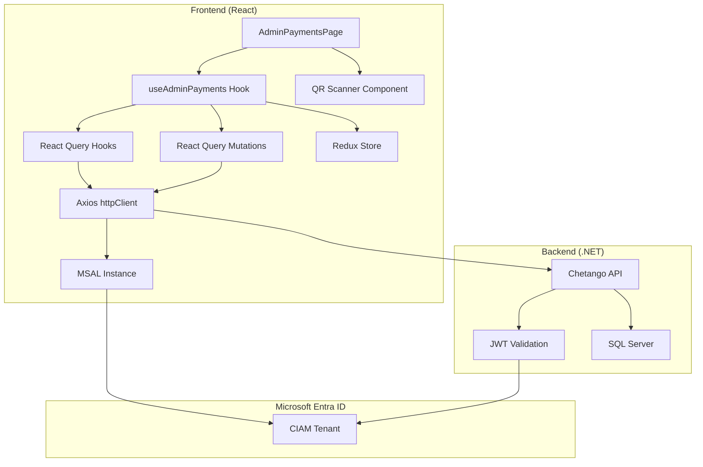
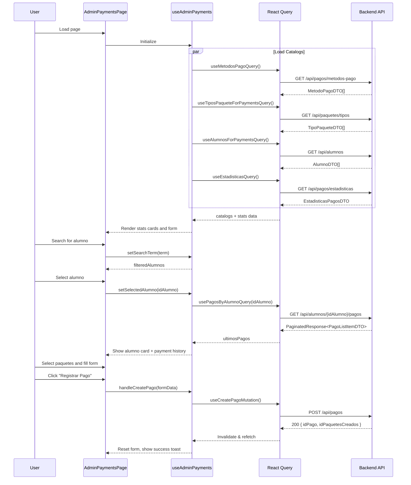

# Design Document: Admin Payments Integration

## Overview

Este documento describe el diseño técnico para integrar la página de Gestión de Pagos del panel de administración del frontend de Chetango con el API backend. La integración reutiliza la configuración de autenticación MSAL existente y sigue los patrones establecidos en las integraciones de paquetes, asistencias y clases.

El frontend está construido con React + TypeScript, usando:
- **MSAL.js** para autenticación con Microsoft Entra External ID
- **React Query** para manejo de estado del servidor
- **Redux Toolkit** para estado de UI
- **Axios** como cliente HTTP

## Architecture




## Components and Interfaces

### 1. API Types

**Archivo:** `src/features/payments/types/paymentTypes.ts`

```typescript
// ============================================
// PAYMENT TYPES - CHETANGO ADMIN
// ============================================

// Re-export shared types from packages
export type { AlumnoDTO, TipoPaqueteDTO, EstadoPaquete, EstadoPaqueteId } from '@/features/packages/types/packageTypes'
export { ESTADO_PAQUETE_MAP, ESTADO_PAQUETE_COLORS } from '@/features/packages/types/packageTypes'

// ============================================
// METODO PAGO TYPES
// ============================================

/**
 * GET /api/pagos/metodos-pago
 * Payment method information
 */
export interface MetodoPagoDTO {
  idMetodoPago: string;           // Guid
  nombre: string;
  descripcion: string;
}

// Predefined payment method icons mapping
export const METODO_PAGO_ICONS: Record<string, string> = {
  'Efectivo': 'dollar-sign',
  'Transferencia Bancaria': 'building-2',
  'Nequi': 'smartphone',
  'Daviplata': 'smartphone',
  'Tarjeta Débito': 'credit-card',
  'Tarjeta Crédito': 'credit-card',
};

// Quick access payment methods (shown as buttons)
export const METODOS_PAGO_RAPIDOS = ['Efectivo', 'Transferencia Bancaria', 'Nequi'];

// ============================================
// ESTADISTICAS TYPES
// ============================================

/**
 * GET /api/pagos/estadisticas
 * Payment statistics response
 */
export interface EstadisticasPagosDTO {
  totalRecaudado: number;
  cantidadPagos: number;
  promedioMonto: number;
  desgloseMetodosPago: DesgloseMétodoPagoDTO[];
}

export interface DesgloseMétodoPagoDTO {
  nombreMetodo: string;
  totalRecaudado: number;
  cantidadPagos: number;
}

// ============================================
// PAGO LIST TYPES
// ============================================

/**
 * GET /api/alumnos/{idAlumno}/pagos - List item
 * GET /api/mis-pagos - List item
 */
export interface PagoListItemDTO {
  idPago: string;                 // Guid
  fechaPago: string;              // DateTime ISO 8601
  montoTotal: number;
  nombreMetodoPago: string;
  nombreAlumno: string;
  cantidadPaquetes: number;
}

// ============================================
// PAGO DETAIL TYPES
// ============================================

/**
 * Package info within a payment detail
 */
export interface PaquetePagoDTO {
  idPaquete: string;              // Guid
  nombreTipoPaquete: string;
  clasesDisponibles: number;
  clasesUsadas: number;
  clasesRestantes: number;
  fechaVencimiento: string;       // DateTime ISO 8601
  estado: string;
  valorPaquete: number;
}

/**
 * GET /api/pagos/{id}
 * Detailed payment information
 */
export interface PagoDetalleDTO {
  idPago: string;                 // Guid
  idAlumno: string;               // Guid
  nombreAlumno: string;
  correoAlumno: string;
  fechaPago: string;              // DateTime ISO 8601
  montoTotal: number;
  idMetodoPago: string;           // Guid
  nombreMetodoPago: string;
  nota: string | null;
  fechaCreacion: string;          // DateTime ISO 8601
  paquetes: PaquetePagoDTO[];
}

// ============================================
// REQUEST TYPES
// ============================================

/**
 * Package to create within a payment
 */
export interface PaquetePagoRequest {
  idTipoPaquete: string;          // Guid
  valorPaquete?: number;          // Optional - if not provided, montoTotal is divided equally
}

/**
 * POST /api/pagos
 * Request body for creating a new payment
 */
export interface CrearPagoRequest {
  idAlumno: string;               // Guid
  fechaPago: string;              // DateTime ISO 8601
  montoTotal: number;
  idMetodoPago: string;           // Guid
  nota?: string | null;
  paquetes: PaquetePagoRequest[];
}

/**
 * PUT /api/pagos/{id}
 * Request body for updating an existing payment
 */
export interface EditarPagoRequest {
  montoTotal: number;
  idMetodoPago: string;           // Guid
  nota?: string | null;
}

// ============================================
// RESPONSE TYPES
// ============================================

/**
 * POST /api/pagos
 * Response after creating a payment
 */
export interface CrearPagoResponse {
  idPago: string;                 // Guid
  idPaquetesCreados: string[];    // Array of Guids
  montoTotal: number;
}

/**
 * Generic paginated response wrapper
 */
export interface PaginatedResponse<T> {
  items: T[];
  pageNumber: number;
  pageSize: number;
  totalCount: number;
  totalPages: number;
}

// ============================================
// QUERY PARAMS
// ============================================

/**
 * Query parameters for fetching payments
 */
export interface PagosQueryParams {
  fechaDesde?: string;            // DateTime ISO 8601
  fechaHasta?: string;            // DateTime ISO 8601
  idMetodoPago?: string;          // Guid
  pageNumber?: number;
  pageSize?: number;
}

/**
 * Query parameters for statistics
 */
export interface EstadisticasQueryParams {
  fechaDesde?: string;            // DateTime ISO 8601
  fechaHasta?: string;            // DateTime ISO 8601
}

// ============================================
// UI STATE TYPES
// ============================================

/**
 * Form data for creating payments
 */
export interface PagoFormData {
  idAlumno: string;
  fechaPago: string;
  idMetodoPago: string;
  selectedPaquetes: SelectedPaquete[];
  montoTotal: number;
  montoManual: boolean;           // true if admin overrode calculated amount
  referencia: string;
  observaciones: string;
}

/**
 * Selected package in the form
 */
export interface SelectedPaquete {
  idTipoPaquete: string;
  nombre: string;
  precio: number;
  clasesDisponibles: number;
}

/**
 * UI state for payments page
 */
export interface PaymentsUIState {
  searchTerm: string;
  selectedAlumnoId: string | null;
  activeTab: 'busqueda' | 'qr';
  isQRScannerActive: boolean;
}

/**
 * Stats for the payments page
 */
export interface PaymentsStats {
  pagosDelMes: number;
  totalRecaudado: number;
  pagosHoy: number;
}
```

### 2. React Query Hooks

**Archivo:** `src/features/payments/api/paymentQueries.ts`

```typescript
import { useQuery } from '@tanstack/react-query';
import { httpClient } from '@/shared/api/httpClient';
import type { ApiError } from '@/shared/api/interceptors';
import type {
  MetodoPagoDTO,
  EstadisticasPagosDTO,
  PagoDetalleDTO,
  PagoListItemDTO,
  PaginatedResponse,
  PagosQueryParams,
  EstadisticasQueryParams,
} from '../types/paymentTypes';
import type { AlumnoDTO, TipoPaqueteDTO } from '@/features/packages/types/packageTypes';

// Query Keys
export const paymentKeys = {
  all: ['payments'] as const,
  metodosPago: () => [...paymentKeys.all, 'metodos-pago'] as const,
  estadisticas: (params: EstadisticasQueryParams) => 
    [...paymentKeys.all, 'estadisticas', params] as const,
  pagosByAlumno: (idAlumno: string, params: PagosQueryParams) => 
    [...paymentKeys.all, 'by-alumno', idAlumno, params] as const,
  pagoDetail: (idPago: string) => 
    [...paymentKeys.all, 'detail', idPago] as const,
  alumnos: () => [...paymentKeys.all, 'alumnos'] as const,
  tiposPaquete: () => [...paymentKeys.all, 'tipos-paquete'] as const,
};

/**
 * Fetches all payment methods
 * GET /api/pagos/metodos-pago
 */
export function useMetodosPagoQuery() {
  return useQuery<MetodoPagoDTO[], ApiError>({
    queryKey: paymentKeys.metodosPago(),
    queryFn: async (): Promise<MetodoPagoDTO[]> => {
      const response = await httpClient.get<MetodoPagoDTO[]>('/api/pagos/metodos-pago');
      return response.data;
    },
    staleTime: 10 * 60 * 1000, // 10 minutes - payment methods rarely change
  });
}

/**
 * Fetches payment statistics for a period
 * GET /api/pagos/estadisticas
 */
export function useEstadisticasQuery(params: EstadisticasQueryParams = {}) {
  return useQuery<EstadisticasPagosDTO, ApiError>({
    queryKey: paymentKeys.estadisticas(params),
    queryFn: async (): Promise<EstadisticasPagosDTO> => {
      const queryParams = new URLSearchParams();
      if (params.fechaDesde) queryParams.append('fechaDesde', params.fechaDesde);
      if (params.fechaHasta) queryParams.append('fechaHasta', params.fechaHasta);
      
      const queryString = queryParams.toString();
      const url = `/api/pagos/estadisticas${queryString ? `?${queryString}` : ''}`;
      const response = await httpClient.get<EstadisticasPagosDTO>(url);
      return response.data;
    },
    staleTime: 1 * 60 * 1000, // 1 minute - stats should be relatively fresh
  });
}

/**
 * Fetches payments for a specific student
 * GET /api/alumnos/{idAlumno}/pagos
 */
export function usePagosByAlumnoQuery(
  idAlumno: string,
  params: PagosQueryParams = {},
  enabled: boolean = true
) {
  return useQuery<PaginatedResponse<PagoListItemDTO>, ApiError>({
    queryKey: paymentKeys.pagosByAlumno(idAlumno, params),
    queryFn: async (): Promise<PaginatedResponse<PagoListItemDTO>> => {
      const queryParams = new URLSearchParams();
      if (params.fechaDesde) queryParams.append('fechaDesde', params.fechaDesde);
      if (params.fechaHasta) queryParams.append('fechaHasta', params.fechaHasta);
      if (params.idMetodoPago) queryParams.append('idMetodoPago', params.idMetodoPago);
      if (params.pageNumber) queryParams.append('pageNumber', params.pageNumber.toString());
      if (params.pageSize) queryParams.append('pageSize', params.pageSize.toString());
      
      const queryString = queryParams.toString();
      const url = `/api/alumnos/${idAlumno}/pagos${queryString ? `?${queryString}` : ''}`;
      const response = await httpClient.get<PaginatedResponse<PagoListItemDTO>>(url);
      return response.data;
    },
    enabled: enabled && !!idAlumno,
  });
}

/**
 * Fetches detailed information for a specific payment
 * GET /api/pagos/{id}
 */
export function usePagoDetailQuery(idPago: string, enabled: boolean = true) {
  return useQuery<PagoDetalleDTO, ApiError>({
    queryKey: paymentKeys.pagoDetail(idPago),
    queryFn: async (): Promise<PagoDetalleDTO> => {
      const response = await httpClient.get<PagoDetalleDTO>(`/api/pagos/${idPago}`);
      return response.data;
    },
    enabled: enabled && !!idPago,
  });
}

/**
 * Fetches all active students for search
 * GET /api/alumnos
 */
export function useAlumnosForPaymentsQuery() {
  return useQuery<AlumnoDTO[], ApiError>({
    queryKey: paymentKeys.alumnos(),
    queryFn: async (): Promise<AlumnoDTO[]> => {
      const response = await httpClient.get<AlumnoDTO[]>('/api/alumnos');
      return response.data;
    },
    staleTime: 5 * 60 * 1000, // 5 minutes
  });
}

/**
 * Fetches all package types for selection
 * GET /api/paquetes/tipos
 */
export function useTiposPaqueteForPaymentsQuery() {
  return useQuery<TipoPaqueteDTO[], ApiError>({
    queryKey: paymentKeys.tiposPaquete(),
    queryFn: async (): Promise<TipoPaqueteDTO[]> => {
      const response = await httpClient.get<TipoPaqueteDTO[]>('/api/paquetes/tipos');
      return response.data;
    },
    staleTime: 5 * 60 * 1000, // 5 minutes
  });
}
```

### 3. React Query Mutations

**Archivo:** `src/features/payments/api/paymentMutations.ts`

```typescript
import { useMutation, useQueryClient } from '@tanstack/react-query';
import { httpClient } from '@/shared/api/httpClient';
import { toast } from 'sonner';
import { paymentKeys } from './paymentQueries';
import type { ApiError } from '@/shared/api/interceptors';
import type {
  CrearPagoRequest,
  CrearPagoResponse,
  EditarPagoRequest,
} from '../types/paymentTypes';

/**
 * Creates a new payment with associated packages
 * POST /api/pagos
 */
export function useCreatePagoMutation() {
  const queryClient = useQueryClient();

  return useMutation<CrearPagoResponse, ApiError, CrearPagoRequest>({
    mutationFn: async (data: CrearPagoRequest): Promise<CrearPagoResponse> => {
      const response = await httpClient.post<CrearPagoResponse>('/api/pagos', data);
      return response.data;
    },
    onSuccess: (data) => {
      toast.success(`Pago registrado exitosamente. ${data.idPaquetesCreados.length} paquete(s) creado(s).`);
      // Invalidate all payment queries to refresh lists and stats
      queryClient.invalidateQueries({ queryKey: paymentKeys.all });
    },
    onError: (error: ApiError) => {
      if (!error.handled) {
        const message = error.message || 'Error al registrar el pago';
        toast.error(message);
      }
    },
  });
}

/**
 * Updates an existing payment
 * PUT /api/pagos/{id}
 */
export function useUpdatePagoMutation() {
  const queryClient = useQueryClient();

  return useMutation<void, ApiError, { idPago: string; data: EditarPagoRequest }>({
    mutationFn: async ({ idPago, data }): Promise<void> => {
      await httpClient.put(`/api/pagos/${idPago}`, data);
    },
    onSuccess: (_data, variables) => {
      toast.success('Pago actualizado exitosamente');
      queryClient.invalidateQueries({ queryKey: paymentKeys.pagoDetail(variables.idPago) });
      queryClient.invalidateQueries({ queryKey: paymentKeys.all });
    },
    onError: (error: ApiError) => {
      if (!error.handled) {
        const message = error.message || 'Error al actualizar el pago';
        toast.error(message);
      }
    },
  });
}
```

### 4. Redux Slice for UI State

**Archivo:** `src/features/payments/store/paymentsSlice.ts`

```typescript
import { createSlice, PayloadAction } from '@reduxjs/toolkit';
import type { PaymentsUIState } from '../types/paymentTypes';

const initialState: PaymentsUIState = {
  searchTerm: '',
  selectedAlumnoId: null,
  activeTab: 'busqueda',
  isQRScannerActive: false,
};

const paymentsSlice = createSlice({
  name: 'payments',
  initialState,
  reducers: {
    setSearchTerm: (state, action: PayloadAction<string>) => {
      state.searchTerm = action.payload;
    },
    setSelectedAlumno: (state, action: PayloadAction<string | null>) => {
      state.selectedAlumnoId = action.payload;
    },
    setActiveTab: (state, action: PayloadAction<'busqueda' | 'qr'>) => {
      state.activeTab = action.payload;
      state.isQRScannerActive = action.payload === 'qr';
    },
    setQRScannerActive: (state, action: PayloadAction<boolean>) => {
      state.isQRScannerActive = action.payload;
    },
    clearSelection: (state) => {
      state.selectedAlumnoId = null;
      state.searchTerm = '';
    },
    resetPaymentsUI: () => initialState,
  },
});

export const {
  setSearchTerm,
  setSelectedAlumno,
  setActiveTab,
  setQRScannerActive,
  clearSelection,
  resetPaymentsUI,
} = paymentsSlice.actions;

export default paymentsSlice.reducer;
```

### 5. Custom Hook: useAdminPayments

**Archivo:** `src/features/payments/hooks/useAdminPayments.ts`

```typescript
import { useState, useMemo, useCallback } from 'react';
import { useAppDispatch, useAppSelector } from '@/app/store/hooks';
import {
  useMetodosPagoQuery,
  useEstadisticasQuery,
  useAlumnosForPaymentsQuery,
  useTiposPaqueteForPaymentsQuery,
  usePagosByAlumnoQuery,
  usePagoDetailQuery,
} from '../api/paymentQueries';
import {
  useCreatePagoMutation,
  useUpdatePagoMutation,
} from '../api/paymentMutations';
import {
  setSearchTerm,
  setSelectedAlumno,
  setActiveTab,
  clearSelection,
} from '../store/paymentsSlice';
import type {
  PagoFormData,
  SelectedPaquete,
  CrearPagoRequest,
  PaymentsStats,
} from '../types/paymentTypes';
import type { AlumnoDTO, TipoPaqueteDTO } from '@/features/packages/types/packageTypes';

export function useAdminPayments() {
  const dispatch = useAppDispatch();
  const uiState = useAppSelector((state) => state.payments);
  
  // Get current month date range for statistics
  const currentMonthRange = useMemo(() => {
    const now = new Date();
    const firstDay = new Date(now.getFullYear(), now.getMonth(), 1);
    const lastDay = new Date(now.getFullYear(), now.getMonth() + 1, 0);
    return {
      fechaDesde: firstDay.toISOString(),
      fechaHasta: lastDay.toISOString(),
    };
  }, []);
  
  // Queries
  const metodosPagoQuery = useMetodosPagoQuery();
  const estadisticasQuery = useEstadisticasQuery(currentMonthRange);
  const alumnosQuery = useAlumnosForPaymentsQuery();
  const tiposPaqueteQuery = useTiposPaqueteForPaymentsQuery();
  
  // Payments for selected alumno
  const pagosAlumnoQuery = usePagosByAlumnoQuery(
    uiState.selectedAlumnoId || '',
    { pageSize: 10 },
    !!uiState.selectedAlumnoId
  );
  
  // Detail query for modal
  const [detailPagoId, setDetailPagoId] = useState<string | null>(null);
  const pagoDetailQuery = usePagoDetailQuery(detailPagoId || '', !!detailPagoId);
  
  // Mutations
  const createMutation = useCreatePagoMutation();
  const updateMutation = useUpdatePagoMutation();
  
  // Filter alumnos by search term
  const filteredAlumnos = useMemo(() => {
    if (!alumnosQuery.data || !uiState.searchTerm) return alumnosQuery.data || [];
    const term = uiState.searchTerm.toLowerCase();
    return alumnosQuery.data.filter(
      (a) =>
        a.nombreCompleto.toLowerCase().includes(term) ||
        a.documentoIdentidad.toLowerCase().includes(term)
    );
  }, [alumnosQuery.data, uiState.searchTerm]);
  
  // Get selected alumno details
  const selectedAlumno = useMemo(() => {
    if (!uiState.selectedAlumnoId || !alumnosQuery.data) return null;
    return alumnosQuery.data.find((a) => a.idAlumno === uiState.selectedAlumnoId) || null;
  }, [uiState.selectedAlumnoId, alumnosQuery.data]);
  
  // Calculate stats
  const stats = useMemo((): PaymentsStats => {
    const data = estadisticasQuery.data;
    return {
      pagosDelMes: data?.cantidadPagos || 0,
      totalRecaudado: data?.totalRecaudado || 0,
      pagosHoy: 0, // Would need separate query or calculation
    };
  }, [estadisticasQuery.data]);
  
  // Get initials from name
  const getInitials = useCallback((nombre: string): string => {
    const parts = nombre.split(' ').filter(Boolean);
    if (parts.length >= 2) {
      return (parts[0][0] + parts[1][0]).toUpperCase();
    }
    return parts[0]?.substring(0, 2).toUpperCase() || '??';
  }, []);
  
  // Format currency
  const formatCurrency = useCallback((amount: number): string => {
    return new Intl.NumberFormat('es-CO', {
      style: 'currency',
      currency: 'COP',
      minimumFractionDigits: 0,
      maximumFractionDigits: 0,
    }).format(amount);
  }, []);
  
  // Calculate total from selected packages
  const calculateTotal = useCallback((paquetes: SelectedPaquete[]): number => {
    return paquetes.reduce((sum, p) => sum + p.precio, 0);
  }, []);
  
  // Handle payment creation
  const handleCreatePago = useCallback(async (formData: PagoFormData) => {
    const request: CrearPagoRequest = {
      idAlumno: formData.idAlumno,
      fechaPago: formData.fechaPago,
      montoTotal: formData.montoTotal,
      idMetodoPago: formData.idMetodoPago,
      nota: formData.observaciones || null,
      paquetes: formData.selectedPaquetes.map((p) => ({
        idTipoPaquete: p.idTipoPaquete,
        // Only include valorPaquete if manual amount was set
        ...(formData.montoManual ? { valorPaquete: formData.montoTotal / formData.selectedPaquetes.length } : {}),
      })),
    };
    
    return createMutation.mutateAsync(request);
  }, [createMutation]);
  
  // Handle QR scan result
  const handleQRScan = useCallback((idAlumno: string) => {
    const alumno = alumnosQuery.data?.find((a) => a.idAlumno === idAlumno);
    if (alumno) {
      dispatch(setSelectedAlumno(idAlumno));
      dispatch(setActiveTab('busqueda'));
    }
  }, [alumnosQuery.data, dispatch]);
  
  return {
    // UI State
    uiState,
    setSearchTerm: (term: string) => dispatch(setSearchTerm(term)),
    setSelectedAlumno: (id: string | null) => dispatch(setSelectedAlumno(id)),
    setActiveTab: (tab: 'busqueda' | 'qr') => dispatch(setActiveTab(tab)),
    clearSelection: () => dispatch(clearSelection()),
    
    // Catalogs
    metodosPago: metodosPagoQuery.data || [],
    tiposPaquete: tiposPaqueteQuery.data || [],
    alumnos: alumnosQuery.data || [],
    filteredAlumnos,
    selectedAlumno,
    isCatalogsLoading: metodosPagoQuery.isLoading || tiposPaqueteQuery.isLoading || alumnosQuery.isLoading,
    
    // Stats
    stats,
    isStatsLoading: estadisticasQuery.isLoading,
    
    // Payments
    ultimosPagos: pagosAlumnoQuery.data?.items || [],
    isPagosLoading: pagosAlumnoQuery.isLoading,
    
    // Detail
    pagoDetail: pagoDetailQuery.data,
    isDetailLoading: pagoDetailQuery.isLoading,
    setDetailPagoId,
    
    // Helpers
    getInitials,
    formatCurrency,
    calculateTotal,
    
    // Mutations
    handleCreatePago,
    handleQRScan,
    isCreating: createMutation.isPending,
    isUpdating: updateMutation.isPending,
    
    // Refetch
    refetchStats: estadisticasQuery.refetch,
    refetchPagos: pagosAlumnoQuery.refetch,
  };
}
```

### 6. Component Flow



## Data Models

### API Response Mapping

| Backend Field | Frontend Type | Notes |
|--------------|---------------|-------|
| `idPago` | `string` | Guid as string |
| `idAlumno` | `string` | Guid as string |
| `nombreAlumno` | `string` | Full name |
| `correoAlumno` | `string` | Email address |
| `fechaPago` | `string` | DateTime ISO 8601 |
| `montoTotal` | `number` | Payment amount |
| `idMetodoPago` | `string` | Guid as string |
| `nombreMetodoPago` | `string` | Payment method name |
| `nota` | `string \| null` | Optional notes |
| `paquetes` | `PaquetePagoDTO[]` | Array of created packages |

### Payment Method Button Mapping

```typescript
const METODO_PAGO_BUTTONS = [
  { nombre: 'Efectivo', icon: DollarSign, variant: 'default' },
  { nombre: 'Transferencia', icon: Building2, variant: 'outline' },
  { nombre: 'Nequi', icon: Smartphone, variant: 'outline' },
  { nombre: 'Otros', icon: FileText, variant: 'outline' },
];
```

### Currency Formatting

```typescript
function formatCurrency(amount: number): string {
  return new Intl.NumberFormat('es-CO', {
    style: 'currency',
    currency: 'COP',
    minimumFractionDigits: 0,
    maximumFractionDigits: 0,
  }).format(amount);
}
// Example: 300000 -> "$ 300.000"
```


## Correctness Properties

*A property is a characteristic or behavior that should hold true across all valid executions of a system—essentially, a formal statement about what the system should do. Properties serve as the bridge between human-readable specifications and machine-verifiable correctness guarantees.*

### Property 1: HTTP Request Headers

*For any* HTTP request made through httpClient, the request SHALL include both `Authorization: Bearer {access_token}` header and `Content-Type: application/json` header.

**Validates: Requirements 1.2, 1.3**

### Property 2: API Response Parsing

*For any* valid response from payment-related APIs:
- MetodosPago response SHALL contain objects with `idMetodoPago` (string), `nombre` (string), and `descripcion` (string) fields
- TiposPaquete response SHALL contain objects with `id` (string), `nombre` (string), `clasesDisponibles` (number), `diasVigencia` (number), and `precio` (number) fields
- Alumnos response SHALL contain objects with `idAlumno` (string), `nombreCompleto` (string), `documentoIdentidad` (string), and optional `correo` (string) fields

**Validates: Requirements 2.2, 2.4, 2.6**

### Property 3: Search Filter Behavior

*For any* search term and list of alumnos, the filtered results SHALL include only alumnos where `nombreCompleto.toLowerCase().includes(searchTerm.toLowerCase())` OR `documentoIdentidad.toLowerCase().includes(searchTerm.toLowerCase())` is true.

**Validates: Requirements 4.3**

### Property 4: Alumno Card Display

*For any* AlumnoDTO, the alumno card SHALL display: avatar with initials derived from nombreCompleto, the full nombreCompleto, and correo (if available).

**Validates: Requirements 4.5**

### Property 5: Initials Generation

*For any* nombre string, the initials SHALL be generated as: first letter of first word + first letter of second word (uppercase). If only one word exists, use first two characters.

**Validates: Requirements 4.5**

### Property 6: QR Scan Selection

*For any* valid QR code containing an idAlumno that exists in the alumnos list, scanning the QR SHALL result in that alumno being selected.

**Validates: Requirements 4.9**

### Property 7: TipoPaquete Card Display

*For any* TipoPaqueteDTO, the package card SHALL display: nombre, clasesDisponibles formatted as "{n} clases", and precio formatted as currency.

**Validates: Requirements 2.8, 5.6**

### Property 8: MontoTotal Calculation

*For any* list of selected paquetes, the calculated montoTotal SHALL equal the sum of all selected paquetes' precio values. If no paquetes are selected, montoTotal SHALL be 0.

**Validates: Requirements 5.8, 6.1, 6.2**

### Property 9: Currency Formatting

*For any* numeric amount, the formatted currency string SHALL follow the pattern "$ {amount}" with thousand separators using periods (e.g., 300000 → "$ 300.000").

**Validates: Requirements 6.6**

### Property 10: Form Validation Rules

*For any* payment form submission attempt, validation SHALL fail if:
- No alumno is selected (idAlumno is empty)
- No paquetes are selected (selectedPaquetes is empty)
- No método de pago is selected (idMetodoPago is empty)
- MontoTotal is less than or equal to 0

**Validates: Requirements 6.5, 7.1, 10.7**

### Property 11: Create Payment Request Format

*For any* valid payment form data, the POST /api/pagos request body SHALL contain:
- `idAlumno` (string, required)
- `fechaPago` (string ISO 8601, required)
- `montoTotal` (number > 0, required)
- `idMetodoPago` (string, required)
- `nota` (string or null, optional)
- `paquetes` (array with at least one item, each containing `idTipoPaquete`)

**Validates: Requirements 7.3**

### Property 12: Update Payment Request Format

*For any* valid edit form data, the PUT /api/pagos/{id} request body SHALL contain:
- `montoTotal` (number > 0, required)
- `idMetodoPago` (string, required)
- `nota` (string or null, optional)

And SHALL NOT contain: `idAlumno`, `fechaPago`, or `paquetes`.

**Validates: Requirements 10.4**

### Property 13: Repeat Last Payment Auto-Fill

*For any* previous payment (PagoDetalleDTO), when "Repetir último pago" is clicked, the form SHALL be auto-filled with:
- Same idMetodoPago
- Same paquetes selection (matching idTipoPaquete)
- Same montoTotal
- Fecha de pago SHALL be today's date (NOT copied from previous payment)

**Validates: Requirements 8.3, 8.4**

### Property 14: Payment Detail Response Parsing

*For any* valid response from GET /api/pagos/{id}, the parsed object SHALL contain all required fields: idPago, idAlumno, nombreAlumno, correoAlumno, fechaPago, montoTotal, idMetodoPago, nombreMetodoPago, nota (nullable), fechaCreacion, and paquetes array.

**Validates: Requirements 9.2**

### Property 15: Paquetes Display in Detail Modal

*For any* PagoDetalleDTO with paquetes array, the modal SHALL display all packages with: nombreTipoPaquete, clasesDisponibles, clasesRestantes, fechaVencimiento formatted, estado, and valorPaquete formatted as currency.

**Validates: Requirements 9.4**

### Property 16: Estado Badge Color Mapping

*For any* package estado, the badge color SHALL be: green for 'Activo', gray for 'Vencido', blue for 'Congelado', orange for 'Agotado'.

**Validates: Requirements 9.5**

### Property 17: Payment List Item Display

*For any* PagoListItemDTO, the list item SHALL display: fechaPago formatted, montoTotal formatted as currency, nombreMetodoPago, and cantidadPaquetes.

**Validates: Requirements 3.5, 11.3**

### Property 18: Stats Display Accuracy

*For any* EstadisticasPagosDTO, the stats cards SHALL display:
- "PAGOS DEL MES" = cantidadPagos
- "TOTAL RECAUDADO" = totalRecaudado formatted as currency

**Validates: Requirements 3.2**


## Error Handling

### HTTP Error Codes

| Status Code | Handling |
|-------------|----------|
| 401 Unauthorized | Redirect to login page via authInterceptor |
| 403 Forbidden | Toast: "No tienes permisos para acceder a esta función" |
| 400 Bad Request | Toast with error message from response body |
| 404 Not Found | Toast: "El recurso especificado no existe" |
| 500+ Server Error | Toast: "Error del servidor. Intenta de nuevo más tarde." |

### Validation Error Messages

```typescript
const VALIDATION_MESSAGES = {
  alumnoRequired: 'Debes seleccionar un alumno',
  paquetesRequired: 'Debes seleccionar al menos un paquete',
  metodoPagoRequired: 'Debes seleccionar un método de pago',
  montoInvalid: 'El monto debe ser mayor a cero',
  fechaInvalid: 'La fecha de pago es inválida',
};
```

### API Error Messages (from backend)

- "El monto total debe ser mayor a cero"
- "Debe especificar al menos un paquete a crear"
- "El alumno especificado no existe"
- "El método de pago especificado no existe"
- "Uno o más tipos de paquete especificados no existen"
- "La suma de los valores de los paquetes no puede ser mayor al monto total del pago"
- "El pago especificado no existe"

## Testing Strategy

### Dual Testing Approach

This feature requires both unit tests and property-based tests for comprehensive coverage:

- **Unit tests**: Verify specific examples, edge cases, and error conditions
- **Property tests**: Verify universal properties across all inputs

### Property-Based Testing Configuration

- **Library**: fast-check (already installed in project)
- **Minimum iterations**: 100 per property test
- **Tag format**: `Feature: admin-payments-integration, Property {number}: {property_text}`

### Test File Structure

```
src/features/payments/
├── __tests__/
│   ├── paymentTypes.test.ts          # Type validation tests
│   ├── paymentQueries.test.ts        # Query hook tests
│   ├── paymentMutations.test.ts      # Mutation hook tests
│   ├── useAdminPayments.test.ts      # Custom hook tests
│   ├── paymentCalculations.test.ts   # Calculation property tests
│   └── paymentValidation.test.ts     # Validation property tests
```

### Property Test Examples

```typescript
import * as fc from 'fast-check';
import { describe, it, expect } from 'vitest';
import { calculateTotal, formatCurrency, getInitials } from '../hooks/useAdminPayments';

describe('Feature: admin-payments-integration', () => {
  // Property 8: MontoTotal Calculation
  it('Property 8: For any list of selected paquetes, montoTotal equals sum of prices', () => {
    fc.assert(
      fc.property(
        fc.array(fc.record({
          idTipoPaquete: fc.uuid(),
          nombre: fc.string(),
          precio: fc.nat({ max: 1000000 }),
          clasesDisponibles: fc.nat({ max: 100 }),
        })),
        (paquetes) => {
          const total = calculateTotal(paquetes);
          const expectedTotal = paquetes.reduce((sum, p) => sum + p.precio, 0);
          return total === expectedTotal;
        }
      ),
      { numRuns: 100 }
    );
  });

  // Property 9: Currency Formatting
  it('Property 9: For any amount, formatted string has thousand separators', () => {
    fc.assert(
      fc.property(
        fc.nat({ max: 100000000 }),
        (amount) => {
          const formatted = formatCurrency(amount);
          // Should start with $ and contain the amount
          return formatted.startsWith('$') && formatted.includes(amount.toLocaleString('es-CO'));
        }
      ),
      { numRuns: 100 }
    );
  });

  // Property 5: Initials Generation
  it('Property 5: For any name, initials are uppercase and max 2 chars', () => {
    fc.assert(
      fc.property(
        fc.string({ minLength: 1, maxLength: 50 }),
        (nombre) => {
          const initials = getInitials(nombre);
          return initials.length <= 2 && initials === initials.toUpperCase();
        }
      ),
      { numRuns: 100 }
    );
  });
});
```

### Unit Test Coverage

- API response parsing
- Error handling scenarios
- Loading states
- Empty states
- Form validation
- QR scanner integration
- Redux state management
