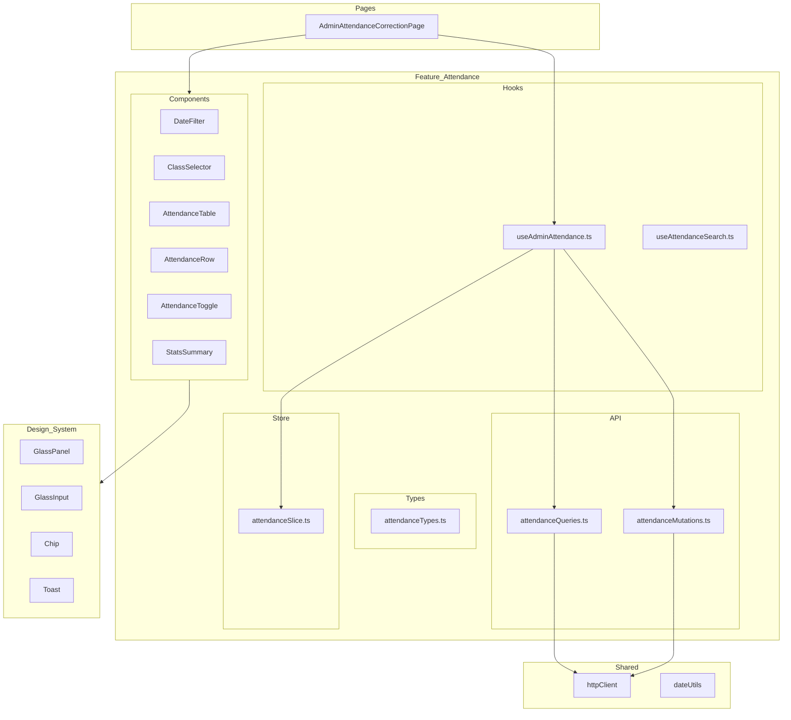

# Design Document - Admin Attendance Correction

## Overview

Este documento describe el diseño técnico para la página de Corrección de Asistencias del panel de administración de Chetango. La implementación sigue la arquitectura Feature-Sliced establecida en el proyecto, utilizando React Query para data fetching, Redux Toolkit para estado local, y el design system glassmorphism existente.

### Flujo Principal
```
Fecha (7 días) → Clase del día → Tabla de Asistencias → Edición/Búsqueda
```

### Endpoints API Consumidos
- `GET /api/admin/asistencias/dias-con-clases` - Rango de fechas con clases
- `GET /api/admin/asistencias/clases-del-dia?fecha={date}` - Clases de una fecha
- `GET /api/admin/asistencias/clase/{idClase}/resumen` - Detalle de asistencia
- `PUT /api/admin/asistencias/clase/{idClase}/alumno/{idAlumno}` - Actualizar asistencia (asumido)

## Architecture



## Components and Interfaces

### Page Component

```typescript
// src/pages/admin/AdminAttendanceCorrectionPage.tsx
interface AdminAttendanceCorrectionPageProps {}

// Orquesta los componentes de la feature
// NO contiene lógica de negocio
```

### Feature Components

```typescript
// src/features/attendance/components/admin/DateFilter/DateFilter.tsx
interface DateFilterProps {
  selectedDate: string; // YYYY-MM-DD
  dateRange: DateRangeResponse | undefined;
  onDateChange: (date: string) => void;
  isLoading: boolean;
}

// src/features/attendance/components/admin/ClassSelector/ClassSelector.tsx
interface ClassSelectorProps {
  selectedClassId: string | null;
  classes: ClassesByDateResponse | undefined;
  onClassChange: (classId: string) => void;
  isLoading: boolean;
}

// src/features/attendance/components/admin/AttendanceTable/AttendanceTable.tsx
interface AttendanceTableProps {
  students: StudentAttendance[];
  searchTerm: string;
  onToggleAttendance: (studentId: string) => void;
  onObservationChange: (studentId: string, observation: string) => void;
  isUpdating: Record<string, boolean>;
}

// src/features/attendance/components/admin/AttendanceRow/AttendanceRow.tsx
interface AttendanceRowProps {
  student: StudentAttendance;
  onToggleAttendance: () => void;
  onObservationChange: (observation: string) => void;
  isUpdating: boolean;
}

// src/features/attendance/components/admin/AttendanceToggle/AttendanceToggle.tsx
interface AttendanceToggleProps {
  isPresent: boolean;
  onToggle: () => void;
  disabled?: boolean;
}

// src/features/attendance/components/admin/PackageStatusBadge/PackageStatusBadge.tsx
interface PackageStatusBadgeProps {
  package: StudentPackage | null;
}

// src/features/attendance/components/admin/StatsSummary/StatsSummary.tsx
interface StatsSummaryProps {
  presentes: number;
  ausentes: number;
  sinPaquete: number;
}

// src/features/attendance/components/admin/StudentSearch/StudentSearch.tsx
interface StudentSearchProps {
  value: string;
  onChange: (value: string) => void;
}
```

### Hooks

```typescript
// src/features/attendance/hooks/useAdminAttendance.ts
interface UseAdminAttendanceReturn {
  // Date Range
  dateRange: DateRangeResponse | undefined;
  isLoadingDateRange: boolean;
  
  // Classes
  classes: ClassesByDateResponse | undefined;
  isLoadingClasses: boolean;
  
  // Attendance Summary
  attendanceSummary: AttendanceSummaryResponse | undefined;
  isLoadingAttendance: boolean;
  
  // State
  selectedDate: string;
  selectedClassId: string | null;
  
  // Actions
  setSelectedDate: (date: string) => void;
  setSelectedClassId: (classId: string) => void;
  toggleAttendance: (studentId: string) => Promise<void>;
  updateObservation: (studentId: string, observation: string) => Promise<void>;
  
  // Mutation states
  isUpdatingAttendance: Record<string, boolean>;
}

// src/features/attendance/hooks/useAttendanceSearch.ts
interface UseAttendanceSearchReturn {
  searchTerm: string;
  setSearchTerm: (term: string) => void;
  filteredStudents: StudentAttendance[];
}
```

## Data Models

### API Response Types

```typescript
// src/features/attendance/types/attendanceTypes.ts

// GET /api/admin/asistencias/dias-con-clases
interface DateRangeResponse {
  hoy: string;        // YYYY-MM-DD
  desde: string;      // YYYY-MM-DD
  hasta: string;      // YYYY-MM-DD
  diasConClases: string[]; // Array of YYYY-MM-DD
}

// GET /api/admin/asistencias/clases-del-dia
interface ClassesByDateResponse {
  fecha: string;      // YYYY-MM-DD
  clases: ClassInfo[];
}

interface ClassInfo {
  idClase: string;    // UUID
  nombre: string;
  horaInicio: string; // HH:mm:ss
  horaFin: string;    // HH:mm:ss
  profesorPrincipal: string;
}

// GET /api/admin/asistencias/clase/{idClase}/resumen
interface AttendanceSummaryResponse {
  idClase: string;
  fecha: string;
  nombreClase: string;
  profesorPrincipal: string;
  alumnos: StudentAttendance[];
  presentes: number;
  ausentes: number;
  sinPaquete: number;
}

interface StudentAttendance {
  idAlumno: string;
  nombreCompleto: string;
  documentoIdentidad: string;
  avatarIniciales: string;
  paquete: StudentPackage | null;
  asistencia: AttendanceStatus;
}

interface StudentPackage {
  estado: PackageState;
  descripcion: string | null;
  clasesTotales: number | null;
  clasesUsadas: number | null;
  clasesRestantes: number | null;
}

type PackageState = 'Activo' | 'Agotado' | 'Congelado' | 'SinPaquete';

interface AttendanceStatus {
  estado: 'Presente' | 'Ausente';
  observacion: string | null;
}

// PUT Request Body (assumed)
interface UpdateAttendanceRequest {
  estado: 'Presente' | 'Ausente';
  observacion?: string;
}
```

### Frontend State Types

```typescript
// src/features/attendance/store/attendanceSlice.ts
interface AttendanceUIState {
  selectedDate: string;
  selectedClassId: string | null;
  searchTerm: string;
  updatingStudents: Record<string, boolean>; // studentId -> isUpdating
}
```

## Correctness Properties

*A property is a characteristic or behavior that should hold true across all valid executions of a system-essentially, a formal statement about what the system should do. Properties serve as the bridge between human-readable specifications and machine-verifiable correctness guarantees.*

### Property 1: Calendar date enablement
*For any* `diasConClases` array returned by the API, the calendar component SHALL enable exactly those dates and disable all other dates within the 7-day range.
**Validates: Requirements 1.3**

### Property 2: Class dropdown content
*For any* `ClassInfo` object, the dropdown option SHALL display the concatenation of `nombre`, time range (`horaInicio` - `horaFin`), and `profesorPrincipal`.
**Validates: Requirements 2.2**

### Property 3: Student row rendering
*For any* `StudentAttendance` object, the ALUMNO column SHALL display `avatarIniciales`, `nombreCompleto`, and `documentoIdentidad` in the correct positions.
**Validates: Requirements 3.2**

### Property 4: Package status badge rendering
*For any* `StudentPackage` object with `estado` value, the badge SHALL render with the correct variant, icon, and text:
- `Activo` → green badge, package icon, description, progress bar
- `Agotado` → warning badge, alert icon, "Paquete Agotado"
- `Congelado` → blue badge, snowflake icon, "Paquete Congelado", helper text
- `SinPaquete` → gray badge, alert icon, "Sin paquete activo"
**Validates: Requirements 3.3, 3.4, 3.5, 3.6**

### Property 5: Attendance toggle visual state
*For any* `AttendanceStatus` with `estado` value, the toggle SHALL display green filled for "Presente" and empty outline for "Ausente".
**Validates: Requirements 3.7**

### Property 6: Attendance toggle persistence
*For any* attendance toggle change, the system SHALL make an API call to persist the change.
**Validates: Requirements 4.4**

### Property 7: Search filtering
*For any* search term and student list, the filtered results SHALL include only students where `nombreCompleto` (case-insensitive) OR `documentoIdentidad` contains the search term.
**Validates: Requirements 6.1, 6.2, 6.3**

### Property 8: Counter updates
*For any* attendance toggle that changes state, the counters (presentes, ausentes) SHALL update to reflect the new totals.
**Validates: Requirements 7.2**

### Property 9: Date serialization round-trip
*For any* valid date, serializing to `YYYY-MM-DD` and parsing back SHALL produce an equivalent date.
**Validates: Requirements 10.1, 10.3**

### Property 10: API data transformation
*For any* valid API response, parsing and transforming to frontend types SHALL preserve all data fields without loss.
**Validates: Requirements 10.4, 10.5**

## Error Handling

### API Errors
- **Network errors**: Display toast with "Error de conexión. Intenta de nuevo."
- **401 Unauthorized**: Redirect to login (handled by authInterceptor)
- **404 Not Found**: Display "Clase no encontrada" message
- **400 Bad Request**: Display specific error message from API
- **500 Server Error**: Display toast with "Error del servidor. Intenta más tarde."

### Optimistic Update Rollback
```typescript
// On mutation error, revert local state
const previousState = queryClient.getQueryData(['attendance', classId]);
queryClient.setQueryData(['attendance', classId], previousState);
toast.error('Error al actualizar asistencia');
```

### Loading States
- Date range loading: Skeleton in date input
- Classes loading: Skeleton in dropdown
- Attendance loading: Table skeleton rows
- Individual update: Spinner on specific toggle

## Testing Strategy

### Testing Framework
- **Unit Tests**: Vitest + Testing Library
- **Property-Based Tests**: fast-check library

### Unit Tests
- Component rendering tests for each component
- Hook behavior tests with mock API responses
- Integration tests for the full page flow

### Property-Based Tests
Each correctness property will be implemented as a property-based test using fast-check:

```typescript
// Example structure
import { fc } from 'fast-check';

describe('Property: Search filtering', () => {
  it('should filter students by name or document', () => {
    fc.assert(
      fc.property(
        fc.array(studentArbitrary),
        fc.string(),
        (students, searchTerm) => {
          const filtered = filterStudents(students, searchTerm);
          return filtered.every(s => 
            s.nombreCompleto.toLowerCase().includes(searchTerm.toLowerCase()) ||
            s.documentoIdentidad.includes(searchTerm)
          );
        }
      ),
      { numRuns: 100 }
    );
  });
});
```

### Test File Structure
```
src/features/attendance/
├── __tests__/
│   ├── useAdminAttendance.test.ts
│   ├── useAttendanceSearch.test.ts
│   ├── attendanceUtils.test.ts
│   └── properties/
│       ├── searchFiltering.property.test.ts
│       ├── packageBadgeRendering.property.test.ts
│       ├── dateSerializationRoundTrip.property.test.ts
│       └── counterUpdates.property.test.ts
├── components/admin/__tests__/
│   ├── DateFilter.test.tsx
│   ├── ClassSelector.test.tsx
│   ├── AttendanceTable.test.tsx
│   └── AttendanceToggle.test.tsx
```

## File Structure

```
src/
├── features/
│   └── attendance/
│       ├── api/
│       │   ├── attendanceQueries.ts      # React Query queries
│       │   └── attendanceMutations.ts    # React Query mutations
│       ├── components/
│       │   └── admin/
│       │       ├── DateFilter/
│       │       │   ├── DateFilter.tsx
│       │       │   ├── DateFilter.module.scss
│       │       │   └── index.ts
│       │       ├── ClassSelector/
│       │       │   ├── ClassSelector.tsx
│       │       │   ├── ClassSelector.module.scss
│       │       │   └── index.ts
│       │       ├── AttendanceTable/
│       │       │   ├── AttendanceTable.tsx
│       │       │   ├── AttendanceTable.module.scss
│       │       │   └── index.ts
│       │       ├── AttendanceRow/
│       │       │   ├── AttendanceRow.tsx
│       │       │   └── index.ts
│       │       ├── AttendanceToggle/
│       │       │   ├── AttendanceToggle.tsx
│       │       │   ├── AttendanceToggle.module.scss
│       │       │   └── index.ts
│       │       ├── PackageStatusBadge/
│       │       │   ├── PackageStatusBadge.tsx
│       │       │   └── index.ts
│       │       ├── StatsSummary/
│       │       │   ├── StatsSummary.tsx
│       │       │   ├── StatsSummary.module.scss
│       │       │   └── index.ts
│       │       ├── StudentSearch/
│       │       │   ├── StudentSearch.tsx
│       │       │   └── index.ts
│       │       └── index.ts              # Barrel export
│       ├── hooks/
│       │   ├── useAdminAttendance.ts
│       │   └── useAttendanceSearch.ts
│       ├── store/
│       │   └── attendanceSlice.ts
│       ├── types/
│       │   └── attendanceTypes.ts
│       ├── utils/
│       │   └── attendanceUtils.ts        # Date formatting, filtering
│       └── index.ts                      # Public exports
├── pages/
│   └── admin/
│       └── AdminAttendanceCorrectionPage.tsx
└── shared/
    └── lib/
        └── dateUtils.ts                  # Date parsing/formatting utilities
```
